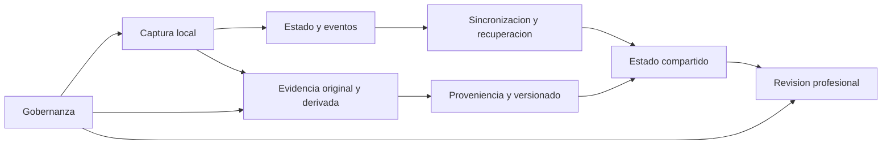

# CAPÍTULO II: MARCO TEÓRICO

Las arquitecturas que coordinan procesos digitales multi-actor deben mantener estados relacionados entre dispositivos y servicios, operar bajo conectividad variable, procesar evidencias heterogéneas y reconstruir el origen de cada salida. El problema no consiste únicamente en digitalizar una actividad: exige conservar operaciones durante una desconexión, propagar cambios sin alterar su significado, controlar reintentos y conflictos y enlazar originales, transformaciones, versiones y responsables. La literatura sobre arquitecturas móviles muestra que continuidad, latencia, pérdida y consumo de recursos dependen de decisiones arquitectónicas mensurables (Kim et al., 2026), mientras la proveniencia biomédica sitúa entidades, actividades, agentes y relaciones de derivación como componentes necesarios para explicar cómo un dato llega a convertirse en resultado (Gierend et al., 2024).

Este capítulo integra esas dimensiones sin confundir niveles de evidencia. Los antecedentes arquitectónicos y tecnológicos constituyen el sustento central; los estudios de evaluación digital se conservan únicamente cuando aportan requisitos transferibles sobre actores, conectividad, modalidades, revisión o gobernanza. La sección 2.1 presenta ambos grupos indicando su función, la sección 2.2 compara capacidades y brechas arquitectónicas y la sección 2.3 fija los conceptos que delimitan el artefacto y su instanciación.

Un instrumento de evaluación se utiliza únicamente como caso de prueba para concretar actores, estados, tareas y evidencias. La arquitectura no depende de las reglas clínicas, dominios, puntuaciones ni propiedades psicométricas del instrumento; estas permanecen fuera del objeto investigado. No se propone diagnóstico autónomo, sustitución del juicio profesional, equivalencia entre instrumentos ni validación psicométrica.

## 2.1 Antecedentes de la investigación

La muestra documental integra antecedentes recientes, fundamentos de sistemas distribuidos y evidencia contextual peruana. Los estudios arquitectónicos constituyen el sustento principal; los estudios de evaluación digital se conservan solo cuando aportan requisitos transferibles sobre actores, conectividad, modalidades, revisión o gobernanza. Las fuentes teóricas se emplean para delimitar garantías y decisiones de diseño, no para atribuir rendimiento al prototipo.

### Procedimiento documental

La revisión se presenta como narrativa y curada, no como revisión sistemática exhaustiva. El corpus reúne 49 textos completos con trazabilidad en fichas, matriz de afirmaciones y bibliografía normalizada. El protocolo documenta las cuatro búsquedas ejecutadas el 17 de septiembre de 2026 y separa evidencia técnica, nacional y normativa. La evidencia peruana no sustituye un diagnóstico del proceso institucional local, que debe levantarse de forma independiente.

### Síntesis de antecedentes arquitectónicos centrales

El núcleo de antecedentes estudia el artefacto desde cuatro problemas complementarios. Kim et al. (2026), Ashista et al. (2026), Zhang (2023), Rodrigues et al. (2023), Laigner et al. (2026), Aguru et al. (2022) y Medhi et al. (2022) abordan distribución, autonomía local, propagación, eventos, capas y recuperación. Viotti y Vukolić (2016), Gomes et al. (2017), Birman y Joseph (1987) y Kokociński et al. (2021) precisan los límites de consistencia, convergencia y orden causal. Gierend et al. (2024), Sembay et al. (2023), Wittner et al. (2022), Missier et al. (2013) y Pan et al. (2023) estudian proveniencia, seguridad, versiones e interoperabilidad. Wang et al. (2023), Geangu et al. (2023) y Singh et al. (2022) complementan el problema mediante adquisición multifuente, referencias temporales, calidad e integridad. Estos trabajos sustentan el problema y las decisiones de diseño; los antecedentes sociotécnicos posteriores aportan restricciones para una instanciación, pero no definen el objeto investigado.

| Eje arquitectónico | Aportes centrales | Limitación que aborda la tesis |
|---|---|---|
| Operación distribuida | Procesamiento local, capas, colas y sincronización incremental | Integrar continuidad con estado multi-actor verificable |
| Confiabilidad de eventos | Entrega, reintentos, orden, replay y observabilidad | Comprobar efecto único, precedencia y recuperación |
| Proveniencia | Entidades, actividades, agentes, versiones y conectores | Reconstruir una salida hasta fuentes y responsables |
| Evidencia multimodal | Archivos estructurados y no estructurados, relojes y calidad | Relacionar originales, derivados, ausencias y transformaciones |
| Evaluación arquitectónica | Latencia, pérdida, recursos, carga y recuperación | Congelar umbrales y probar fallos de forma reproducible |

La presentación detallada comienza con los antecedentes arquitectónicos y tecnológicos centrales, continúa con las condiciones sociotécnicas transferibles y deja la delimitación del caso al final. Este orden hace explícita la jerarquía de evidencia: el vacío y la contribución principal pertenecen a la arquitectura.

### Antecedentes arquitectónicos y tecnológicos centrales

Kim et al. (2026) compararon una arquitectura móvil modular con procesamiento edge frente a un pipeline secuencial dependiente de nube para fenotipado digital. Implementaron dos prototipos Android y ejecutaron dos experimentos controlados de 48 horas con usuarios virtuales, cinco flujos de sensores y cuatro cargas aproximadas. Screenomics permaneció operativo durante las 48 horas en todas las cargas, mientras el sistema tradicional falló antes en las tres cargas superiores; sin embargo, permanecer operativo no implicó captura completa, pues la fidelidad final de Screenomics varió entre 44,2 % y 99,1 % según carga. Sus medianas de procesamiento total oscilaron entre 0,90 y 9,32 segundos, frente a 30,1-398,1 segundos del diseño tradicional. Los autores concluyeron que modularidad, paralelismo y procesamiento local mejoraron continuidad y rendimiento bajo las condiciones ensayadas.

Para esta investigación, el antecedente aporta categorías mensurables de continuidad, fidelidad, latencia y recursos y justifica procesamiento próximo a la captura. Los usuarios virtuales, un solo teléfono, tareas guionadas, duración limitada y Wi-Fi estable para latencia impiden adoptar sus valores como umbrales de la arquitectura propuesta. Queda la necesidad de examinar desconexión, reconexión, dispositivos y evidencias bajo una configuración propia.

Ashista et al. (2026) evaluaron la factibilidad de un registro electrónico offline-first en dos clínicas con recursos limitados. Desarrollaron un estudio mixto con encuestas y 11 entrevistas a profesionales, analizadas mediante un marco cualitativo. El sistema se adaptó a cada clínica y, después de que la sincronización repetida de la base completa dejara datos locales invisibles para otros profesionales, fue rediseñado para enviar solo eventos nuevos o modificados. Diez de once participantes lo consideraron fácil de usar y todos los entrevistados de una clínica informaron problemas de sincronización multiusuario antes del cambio. Los autores concluyeron que el sistema era factible y que la sincronización incremental mejoraba cualitativamente la eficiencia y confiabilidad del flujo semi-online.

Para esta investigación, el estudio aporta evidencia de que persistencia local y coordinación multi-actor son problemas distintos y sustenta el intercambio incremental. La muestra reducida, el posible sesgo de selección y deseabilidad, el patrocinio y la ausencia de latencias, tasas de conflicto o experimentos de fallo limitan su conclusión. Queda la necesidad de caracterizar convergencia, duplicación y conflictos de forma explícita.

Zhang (2023) desarrolló una arquitectura web para compartir y manipular de manera sincronizada datos médicos volumétricos entre profesionales remotos. Implementó un prototipo cliente-servidor con Node.js, Socket.IO, WebSocket, MySQL y renderizado WebGL, y realizó 30 pruebas por configuración con datos de resonancia y ultrasonido de un sujeto sano. Tras la carga inicial, los clientes conservaron los datos y compartieron señales de interacción; los mensajes se persistieron por separado. El retraso de sincronización fue habitualmente inferior a aproximadamente 5 milisegundos en la red ensayada, mientras la carga inicial podía alcanzar alrededor de 200 segundos. El autor concluyó que el enfoque permitía colaboración visual sincronizada sobre datos dinámicos.

Para esta investigación, el antecedente aporta la separación entre evidencia pesada, eventos pequeños y estado de colaboración. El caso demostrativo, la red de alta velocidad, la falta de integración clínica y la ausencia de pruebas de desconexión, entrega, orden y seguridad limitan su transferencia. Queda la necesidad de combinar comunicación conectada con durabilidad y recuperación offline.

Rodrigues et al. (2023) propusieron VitalSense para combinar edge, fog y cloud en monitorización sanitaria remota. Desarrollaron una arquitectura jerárquica y realizaron experimentos preliminares de sharding sobre más de dos millones de registros, comparando una base centralizada y dos shards en contenedores de una misma computadora durante diez ejecuciones. El diseño asignó filtrado y cifrado al edge, colas y descarga de trabajo al fog y localización distribuida a un servicio de nombres en cloud. El sharding redujo aproximadamente 20 % el tiempo de las dos consultas evaluadas. Los autores concluyeron que la combinación por capas podía reducir tráfico y apoyar escalabilidad y localización de datos.

Para esta investigación, el antecedente aporta separación de responsabilidades, colas ante sobrecarga y un índice para ubicar fragmentos por dispositivo y tiempo. La evaluación local de solo dos consultas no midió proximidad real, movilidad, fallos ni el despliegue completo, que permaneció futuro. Queda la necesidad de mantener localizable la evidencia distribuida durante desconexiones y recuperación.

Gierend et al. (2024) mapearon enfoques, modelos, requisitos y desafíos de proveniencia biomédica. Realizaron una revisión de alcance según Arksey y O'Malley y PRISMA-ScR, con búsquedas en PubMed y Web of Science: de 624 registros deduplicados incluyeron 66 estudios. Extrajeron modelos, almacenamiento, consultas, requisitos y problemas; 58 trabajos abordaron gestión práctica, W3C PROV apareció en 25 de los 58 con características de modelo y 47 artículos informaron 74 desafíos. Los autores concluyeron que la proveniencia favorece integridad, reproducibilidad, interoperabilidad y trazabilidad, pero conserva problemas de granularidad, calidad, escalabilidad y correspondencia entre requisitos y validación.

Para esta investigación, la revisión aporta la estructura entidad-actividad-agente y un marco para diferenciar captura, almacenamiento, consulta y evaluación. Al ser una revisión de alcance, no calificó calidad ni riesgo de sesgo, excluyó literatura gris y reunió dominios heterogéneos. Queda la necesidad de fijar una granularidad suficiente para reconstruir el proceso instanciado sin capturar información indiscriminada.

Sembay et al. (2023) caracterizaron métodos, tecnologías y estándares de gestión de proveniencia en sistemas de información de salud. Ejecutaron una revisión sistemática basada en Kitchenham y *snowballing* sobre seis bases: recuperaron 239 registros, incluyeron 14 y añadieron tres, para un total de 17 estudios. Clasificaron modelos PROV, tecnologías semánticas, bases, blockchain, middleware y tipos de sistema, y propusieron siete propiedades: almacenamiento, disponibilidad, trazabilidad, confidencialidad, integridad, autenticidad y auditabilidad. Diez de los 17 estudios emplearon modelos de la familia PROV. Los autores concluyeron que la proveniencia puede fortalecer gestión y confianza, aunque persisten barreras técnicas, organizativas, regulatorias e interoperables.

Para esta investigación, el antecedente aporta dimensiones diferenciadas para no reducir trazabilidad a logs ni seguridad a una sola propiedad. La selección de 17 estudios, el periodo 2010-2020, el sesgo potencial de bases e interpretación y la evaluación industrial preliminar restringen su alcance. Queda la necesidad de integrar esas dimensiones con evidencias infantiles y autorización por rol.

Wittner et al. (2022) diseñaron un modelo ligero para conectar fragmentos de proveniencia generados por organizaciones diferentes. Desarrollaron iterativamente una extensión de W3C PROV y demostraron su factibilidad en un pipeline multiinstitucional de patología digital, con automatización parcial. Cada proceso produjo un *bundle* inmutable; conectores con identificadores y URI enlazaron emisor y receptor, los conectores de salto mantuvieron navegación ante piezas ausentes y una actualización creó una copia sin borrar la anterior. Los autores concluyeron que el modelo permitía recorrer cadenas distribuidas y conservar evolución sin imponer un repositorio único.

Para esta investigación, el antecedente aporta el patrón de fragmentos conectados, versiones preservadas y detección de discontinuidades. La automatización cubrió solo etapas computacionales y la integridad, no repudio, opacidad y actualización de conjuntos reutilizados quedaron parcialmente resueltos; además, el dominio fue patología digital. Queda la necesidad de enlazar captura local, transformación y revisión profesional cuando algún componente se encuentre temporalmente desconectado.

Gierend et al. (2023) implementaron una prueba de concepto de proveniencia por elemento para un centro alemán de integración de datos. Siguieron un ciclo de requisitos, diseño, codificación y pruebas con siete tipos de elementos simulados, inicialmente 700 000 registros y bloques posteriores de hasta 900 000 elementos. La clase Python registró fuente, destino, transformación, calidad, procedimiento, versión, responsables y tiempo mediante captura manual y automática, y exportó formatos W3C PROV y FHIR. El tiempo informado fue de 0,0039-0,02601 segundos por elemento y la cobertura de código superó 90 %. Los autores concluyeron que la captura interoperable por elemento era técnicamente factible.

Para esta investigación, el antecedente aporta un esquema implementable para vincular respuesta o evidencia con transformación, responsable y versión. Los datos ficticios, la ausencia de operación real y la falta de preparación para auditoría acreditada, seguridad y almacenamiento a escala limitan su madurez. Queda la necesidad de aplicar esa estructura a los actores, modalidades y decisiones de un flujo multi-actor concreto.

Cejudo et al. (2025) diseñaron y evaluaron DeltaTrace como plataforma de datos sanitarios con trazabilidad y versionado de extremo a extremo. Desarrollaron una arquitectura con Kafka, REST, Spark, Delta Lake, Airflow, MLflow y PostgreSQL, y ejecutaron cargas sintéticas de 50 a 30 000 solicitudes por segundo sobre servidores de 8 y 24 núcleos, complementadas con datos de 71 adultos mayores. El pipeline conservó originales en bronce, datos limpios en plata y agregados o predicciones en oro, con *checkpoints* y versiones. Bajo 30 000 solicitudes por segundo, la capa plata tardó 7,5 minutos con 8 núcleos y 5,6 con 24. Los autores concluyeron que la plataforma integraba escalabilidad, recuperación y trazabilidad reproducible bajo la configuración estudiada.

Para esta investigación, el antecedente aporta separación original-derivado, orquestación y vinculación de datos, modelos y ejecuciones. La evaluación en un servidor, con tasas constantes y sin despliegue multinodo, interacción humana, imagen, audio o texto limita su transferencia. Queda la necesidad de extender la trazabilidad a evidencia multimodal y revisión profesional sin adoptar sus tiempos como criterios propios.

Wang et al. (2023) construyeron un sistema para ejecutar tareas cognitivas y registrar simultáneamente interacción, mirada, movimiento, audio y EEG. Desarrollaron un banco de 16 tareas con versión cliente y web y lo ilustraron con 238 participantes adultos, incluidos controles y personas con distintos trastornos. Los resultados estructurados se almacenaron en MySQL y las señales crudas se cargaron como archivos; las fuentes operaron a frecuencias distintas y se asociaron con marcas de tarea. Los autores presentaron adquisición multifuente y análisis demostrativos, pero no cuantificaron precisión temporal, deriva, pérdida o recuperación. En su conclusión formal, sostuvieron que el banco integrado apoyaba el tamizaje de indicadores conductuales y el análisis individualizado de datos. Por separado, en la discusión precisaron que el diagnóstico requiere que el médico integre esos indicadores con escalas, observación e historia clínica.

Para esta investigación, el antecedente aporta persistencia híbrida, roles y vínculo entre tareas, logs y originales heterogéneos. La población adulta, la separación entre cliente y web, la ausencia de análisis unificado y la sincronización no cuantificada limitan su aplicabilidad. Queda la necesidad de una línea temporal verificable y un manifiesto común para fuentes y resultados infantiles.

Laigner et al. (2026) caracterizaron prácticas y desafíos de gestión de eventos en arquitecturas de microservicios. Combinaron minería del volcado de Stack Exchange con análisis manual de una muestra aleatoria de 628 preguntas, codificada por dos autores y arbitrada por un tercero. Examinaron encolado, entrega, almacenamiento, procesamiento y sincronización; dentro de la taxonomía, la semántica débil de entrega representó 17,20 % del total analizado, las dependencias 12,54 %, el orden 10,39 % y el replay 8,96 %. Los autores concluyeron que la comunicación asíncrona reduce acoplamiento, pero desplaza complejidad hacia consistencia, reintento, observabilidad y recuperación.

Para esta investigación, el antecedente aporta un catálogo de riesgos para eventos de sesión y justifica identidad, idempotencia, precedencia y replay controlado. Stack Overflow como única fuente, los filtros y la codificación cualitativa impiden interpretar los porcentajes como tasas de fallo productivas. Queda la necesidad de examinar esos riesgos en un flujo sanitario concreto con estado multi-actor.

Aguru et al. (2022) investigaron arquitecturas, protocolos y desafíos de IoT sanitario para diseñar una arquitectura de referencia. Realizaron una investigación sistemática cualitativa guiada por PRISMA, identificaron 160 fuentes y conservaron 136 referencias. Compararon modelos y seleccionaron IWF como base para una arquitectura de siete capas que separa sensores, conectividad, edge/fog, acumulación, abstracción, aplicaciones y colaboración; la capa de abstracción incluyó calidad, ETL, comparación y reconciliación. Los autores concluyeron que la propuesta podía orientar futuras aplicaciones sanitarias inteligentes y afrontar heterogeneidad e interoperabilidad.

Para esta investigación, el antecedente aporta una vista integral de responsabilidades desde dispositivo hasta decisión humana. La selección arquitectónica fue cualitativa y la propuesta no fue implementada ni evaluada de extremo a extremo; privacidad, seguridad y escalabilidad permanecieron como desafíos. Queda la necesidad de concretar y evaluar esas capas en un artefacto delimitado.

Medhi et al. (2022) propusieron una arquitectura dew para decisiones sanitarias offline y de baja latencia cerca de sensores. Implementaron un prototipo móvil y una simulación iFogSim con tres nodos dew, un nodo fog y cloud, utilizando 1000 registros ECG secundarios. El teléfono ejecutó preprocesamiento y una CNN ligera, guardó resultados en MySQL local durante la desconexión y sincronizó la nube a intervalos. La simulación informó un RTT promedio dew de 2300 milisegundos y menores recursos que las configuraciones comparadas. Los autores concluyeron que el procesamiento dew reducía dependencia de red y podía sostener funciones locales.

Para esta investigación, el antecedente aporta el concepto de nodo autónomo con procesamiento, persistencia y sincronizador. La combinación de simulación y laboratorio, el máximo de tres nodos, el dominio ECG y la ausencia de conflictos, duplicados, orden y recuperación limitan la transferencia. Queda la necesidad de aplicar autonomía local sin trasladar inferencia clínica ni cifras de rendimiento al caso infantil.

Geangu et al. (2023) diseñaron y validaron EgoActive para capturar de forma concurrente video y audio egocéntricos, ECG y aceleración en investigación infantil naturalista. Desarrollaron hardware y software y realizaron validaciones de campo visual, señal, reloj, sincronización, calidad y experiencia con muestras específicas, incluida una prueba doméstica con siete familias. Una señal luminosa común identificó sesión y origen temporal, los dispositivos guardaron en microSD, una estación respaldó archivos y herramientas Python alinearon y etiquetaron calidad. Sobre 1444 series temporales, con 1218 señales reales, el algoritmo detectó todas las señales y produjo tres falsos positivos; los intervalos no utilizables se conservaron. Los autores concluyeron que la plataforma permitía captura familiar sincronizada y técnicamente revisable.

Para esta investigación, el antecedente aporta reloj común, redundancia, originales locales, derivados y preservación de defectos. La aplicación se probó en un modelo de tableta, la señal tenía límites de unicidad, el sistema exigía competencia técnica y audio y video domésticos planteaban privacidad. Queda la necesidad de integrar sincronización temporal y calidad con autorización, linaje y revisión profesional.

### Antecedentes sociotécnicos de aplicación

Kalanadhabhatta et al. (2025) evaluaron la factibilidad de trasladar al hogar una observación estructurada de interacción padre-hijo y extraer información individual y diádica de audio y fisiología. Desarrollaron un estudio domiciliario con 34 díadas y una sesión de juego de 25 minutos guiada por aplicación, dividida en juego dirigido por el niño, juego dirigido por el adulto y limpieza. Registraron audio continuo y señales de dos dispositivos vestibles; después segmentaron, transcribieron, alinearon, diarizaron y resumieron las corrientes por actor y fase. En tres clips validados, el pipeline obtuvo 30,1 % de error de diarización y 11,8 % de error de palabra; la combinación multimodal alcanzó F1 = 0,92, sin diferencia significativa demostrada frente a la mejor modalidad aislada. En su conclusión formal, los autores sostuvieron que los resultados respaldaban la factibilidad técnica de utilizar audio o fisiología capturados durante interacciones domiciliarias estructuradas para la evaluación conductual. Por separado, en la discusión señalaron que la evaluación basada en sensores debería complementar, no reemplazar, el juicio profesional.

Para esta investigación, el antecedente aporta la relación entre díada, fase, original, transformación, modalidad derivada y calidad, además del control parental para revisar audio antes de cargarlo. La muestra pequeña y predominantemente blanca, dos BASC-3 incompletos, la pérdida fisiológica y el costo de dos dispositivos limitan su transferencia; sus clasificadores no se incorporarán al caso. Queda la necesidad arquitectónica de conservar esa cadena multimodal sin convertir las derivaciones automáticas en interpretación clínica.

Modi et al. (2023) desarrollaron y probaron un proceso digital para administrar PARCA-R, recabar consentimiento y respuestas parentales, almacenar resultados y devolverlos a familias y equipos clínicos. Ejecutaron un piloto de mejora de servicio en seis unidades neonatales del NHS con padres de 41 niños nacidos antes de 30 semanas: 38 familias se registraron, 30 consintieron y 23 alcanzaron la ventana de aplicación. La plataforma separó identificadores, programó recordatorios, habilitó el instrumento por edad corregida, enlazó resultados seudonimizados y los remitió al equipo clínico. Completaron correctamente el cuestionario 21 de 23 familias elegibles, equivalentes al 91 %, y 30 de 38 registradas otorgaron consentimiento electrónico. Los autores concluyeron que el procedimiento era factible y potencialmente escalable dentro del seguimiento neonatal.

Para esta investigación, el estudio aporta un flujo trazable entre invitación, autorización, ventana temporal, captura parental, almacenamiento y entrega profesional. El piloto fue pequeño, regional, afectado por la pandemia y limitado a PARCA-R y prematuridad; además, dos aplicaciones resultaron inválidas por errores de edad o agenda. La transferencia admisible se limita a requisitos de control temporal, autorización, sincronización multi-actor y cierre humano.

Qureshi et al. (2026) examinaron tecnologías digitales destinadas a mejorar la comunicación entre pacientes pediátricos con cáncer, cuidadores y profesionales. Realizaron una revisión de alcance conforme a JBI y PRISMA-ScR sobre 28 estudios publicados entre 2014 y 2024, con cribado independiente y extracción verificada. Compararon entradas familiares y profesionales, tableros, alertas, portales y acceso en tiempo real. Una intervención generó 339 alertas en 16 semanas y documentó acción clínica en el 52 %; otras informaron respuestas o discusión de resultados en consulta, pero con medidas heterogéneas. Los autores concluyeron que estas herramientas pueden apoyar comunicación y acceso a información, aunque la falta de integración, reciprocidad y cobertura institucional puede mantener silos o dejar reportes sin respuesta.

Para esta investigación, la revisión aporta el concepto de circuito cerrado entre captura, recepción, asignación, revisión, acción y devolución. Su alcance exclusivo en oncología pediátrica, el predominio de pilotos o sitios únicos, la heterogeneidad y la restricción lingüística limitan la generalización. Queda la necesidad de representar el cierre profesional como parte del estado compartido de una evaluación, no como una consecuencia supuesta de mostrar una alerta.

Amed et al. (2025) evaluaron la usabilidad, experiencia y utilidad de una plataforma interoperable desde la perspectiva de cuidadores de niños con diabetes tipo 1 y profesionales. Desarrollaron un piloto observacional de seis meses con métodos mixtos en un hospital pediátrico canadiense; participaron 19 cuidadores, 18 aportaron encuestas o entrevistas y 11 profesionales completaron 41 encuestas. La aplicación familiar y el tablero profesional integraron dispositivos mediante API y FHIR, sincronizaron datos y permitieron preparar consultas, revisar tendencias, asignar tareas y registrar recomendaciones. La puntuación SUS media de 17 cuidadores fue 71,9; 37 de 41 encuestas profesionales expresaron satisfacción y 36 de 41 señalaron mejor interacción. Los autores concluyeron que la vista integrada era usable y favorecía la preparación y colaboración percibidas.

Para esta investigación, el antecedente aporta integración por roles, proveniencia básica de entradas manuales y continuidad entre preparación familiar y revisión profesional. La muestra pequeña y homogénea, la ausencia de perspectiva infantil directa, el conflicto de interés declarado y la falta de métricas técnicas de conectividad y sincronización restringen el resultado a experiencia y utilidad percibida. Queda la necesidad de articular la colaboración visible con evidencia técnica de propagación, consistencia y cierre.

Bhavnani et al. (2025) evaluaron la validez de criterio, predictiva y convergente de DEEP como evaluación cognitiva digital para preescolares. Realizaron una validación longitudinal en 120 aldeas rurales de India, con 1359 aplicaciones alrededor de 39 meses, 1234 alrededor de 60 meses y 600 alrededor de 95 meses; submuestras recibieron BSID-III o Raven CPM. Personal no especialista administró 14 juegos offline en tableta, bajo observación aproximada del 10 % de las visitas y supervisión periódica. El análisis combinado presentado en el cuerpo del artículo informó una correlación con la edad de r = 0,87 para 3193 aplicaciones, con IC 95 % de 0,86-0,89, mientras el resumen informó r = 0,83 e IC 95 % de 0,82-0,84; se conserva explícitamente esta discrepancia interna. DEEP correlacionó además con BSID-III en r = 0,50 y con CPM en r = 0,37, y las puntuaciones preescolares se asociaron con resultados académicos posteriores. Los autores concluyeron que DEEP ofrece una medida cognitiva digital escalable con evidencia longitudinal en ese contexto.

Para esta investigación, el estudio demuestra que operación offline, eventos de interacción, desidentificación y supervisión humana pueden coexistir en evaluación infantil digital. Las edades no estuvieron uniformemente distribuidas y no se informó confiabilidad test-retest, validez estructural o transcultural. Su aporte se restringe a separar la corrección y continuidad de la plataforma de cualquier inferencia psicométrica sobre el instrumento del caso.

La Valle et al. (2022) revisaron la teleevaluación utilizada para facilitar diagnósticos en niños con preocupaciones del desarrollo distintas del autismo. Ejecutaron una revisión sistemática PRISMA registrada en PROSPERO, buscaron en seis bases y seleccionaron nueve estudios, con extracción por revisores y evaluación de calidad mediante herramientas NHLBI. Siete estudios emplearon videoconferencia en tiempo real y dos *store-and-forward*; profesionales locales facilitaron exploraciones o cargaron fotografías y resúmenes para revisión especialista. Ocho estudios fueron calificados como de calidad regular y uno como de buena calidad; solo dos informaron precisión diagnóstica. Los autores concluyeron que la telesalud puede facilitar evaluación especializada, pero la base de evidencia era pequeña y metodológicamente limitada.

Para esta investigación, la revisión aporta las rutas síncrona y asíncrona y la separación entre captura local, transmisión, revisión especialista e informe. Ningún estudio se realizó en el hogar, la demografía fue incompleta y se mezclaron edades y condiciones, lo que restringe la transferencia. Queda la necesidad de sostener ambas rutas con evidencia persistente y devolución trazable, sin atribuir a la plataforma la decisión profesional.

Gangi et al. (2025) evaluaron validez convergente, confiabilidad test-retest, factibilidad y satisfacción del TELE-ASD-PEDS aplicado en hogares. Presentaron un análisis intermedio de un ensayo aleatorizado de dos centros con 182 niños de 18 a 42 meses que completaron dos evaluaciones; la segunda fue remota para 92 y presencial para 90. El cuidador ejecutó actividades guiadas por Zoom, un segundo evaluador desconoció el resultado inicial y los desacuerdos activaron revisión. En el brazo con segunda evaluación presencial, 78 casos tuvieron diagnósticos determinados en ambas visitas y 73 de 78, equivalentes al 94 %, concordaron, con κ = 0,82. La decisión inicial se alcanzó en 167 de 182 casos y 15 se difirieron. Los autores concluyeron que el procedimiento mostró validez, confiabilidad y satisfacción prometedoras para TAP.

Para esta investigación, el antecedente aporta guía del cuidador, diferimiento, evaluación adicional, consenso e informe supervisado por psicólogo. La población remitida, el instrumento específico de autismo, la participación de solo dos estados y la exigencia de inglés, dispositivo y conectividad limitan su transferencia. El requisito arquitectónico transferible es representar incertidumbre y escalamiento sin trasladar resultados clínicos entre instrumentos.

Wild et al. (2023) exploraron las opiniones de niños, jóvenes y cuidadores sobre almacenamiento, vinculación, intercambio y consentimiento de uso de datos de salud infantil. Realizaron un estudio cualitativo en Aotearoa Nueva Zelanda con cinco grupos focales y 24 participantes: 10 cuidadores, 10 niños de 5 a 12 años y 4 jóvenes de 13 a 16 años. Las sesiones se grabaron, transcribieron y analizaron temáticamente con principios Kaupapa Māori. Surgieron tres temas: ser más que un número, mantener los datos en manos seguras y entender el consentimiento como relación activa. La disposición a compartir dependió del destinatario, propósito, beneficio y custodio. Los autores concluyeron que niños y familias esperan participación, confianza y renovación de la autorización cuando cambian el uso o la capacidad del menor.

Para esta investigación, el estudio aporta atributos contextuales para gobernar cada evidencia y su intercambio. La muestra fue pequeña, vinculada a un solo servicio, con pocos adolescentes y composición cultural específica; sus opiniones no equivalen a obligaciones jurídicas peruanas. Queda la necesidad de traducir finalidad, custodia, vigencia y retiro a estados comprensibles y auditables sujetos a la normativa aplicable.

Mirabella et al. (2025) examinaron cómo niños de 5 a 7 años expresan, negocian y retiran asentimiento en investigaciones digitales. Elaboraron una síntesis cualitativa retrospectiva de tres estudios de caso, cada uno con 4 a 17 participantes, y seleccionaron 27 segmentos de video para análisis de interacción multimodal. Los procedimientos utilizaron relatos, exploración de dispositivos, observación, entrevistas y transcripciones orientadas a la acción. Gestos, mirada, postura, silencio, juego y alejamiento acompañaron aceptación, duda o disenso, y las respuestas adultas incluyeron pausas, alternativas y roles de observación. Los autores concluyeron que el asentimiento es continuo, relacional, multimodal y sensible al poder y al contexto, no una confirmación verbal única.

Para esta investigación, el antecedente aporta un flujo infantil con explicación adecuada, exploración previa, oportunidades renovadas y control para pausar o salir. La síntesis fue retrospectiva, se concentró en aulas y edades concretas y no comparó protocolos formales; las señales no tienen significado universal. Queda la necesidad de que el sistema registre decisiones humanas contextuales sin clasificar automáticamente la conducta infantil.

McElwain et al. (2024) evaluaron la experiencia de familias que utilizaron en el hogar un dispositivo infantil multimodal con audio, ECG y movimiento. Realizaron dos estudios de métodos mixtos guiados por el Digital Health Checklist: el primero entrevistó a 42 padres de 43 niños después de dos grabaciones de alrededor de ocho horas y el segundo encuestó a 110 padres después de tres días. Los cuidadores instalaron el equipo, controlaron inicio y parada y valoraron claridad, comodidad, seguridad, privacidad y carga. Las medias favorecieron claridad de instrucciones, instalación y seguridad percibida; la dificultad de completar tres días fue neutral en promedio, mientras las entrevistas revelaron cambios de rutina, molestias y demanda de indicadores de batería y grabación. Los autores concluyeron que la captura era aceptable para muchas familias, con mejoras necesarias en control y comodidad.

Para esta investigación, el antecedente aporta control visible de captura, pausa, tratamiento de terceros, seudonimización y retiro parcial o total de grabaciones. Los niños no fueron entrevistados directamente, los subgrupos etarios fueron pequeños y las muestras tuvieron alto nivel educativo. Queda la necesidad de incorporar la experiencia infantil y diferenciar facilidad técnica, privacidad y carga por actor y tarea.

Leo et al. (2022) revisaron dispositivos, conjuntos de datos y métodos automáticos para analizar movimiento infantil mediante video. Desarrollaron un estado del arte no sistemático que organizó 20 trabajos: siete con recién nacidos, siete con lactantes y seis con niños pequeños. Compararon cámaras RGB o de profundidad, audio, sensores, anotación, estimación de pose, modelado temporal y visualización. Identificaron ventajas de los enfoques sin marcadores, pero también oclusión, iluminación variable, movimiento de cámara, privacidad, escasez de datos y costo de anotación; un ejemplo multifuente reunía 160 sesiones sincronizadas de 121 niños. En la discusión, la revisión identificó como necesidades datos y procesamiento robustos, transparencia, visualización y estimación de incertidumbre. En su conclusión formal, los autores sintetizaron el panorama metodológico de análisis de movimiento infantil basado en imagen y video y señalaron futuras direcciones para extracción de movimiento, estimación de pose y modelado temporal.

Para esta investigación, la revisión aporta el ciclo captura-almacenamiento-anotación-derivación-visualización y los metadatos de contexto que condicionan el video infantil. Al no seguir un protocolo sistemático reproducible ni validar una plataforma propia, y al reunir conjuntos y tareas heterogéneos, no permite transferir rendimientos diagnósticos. Queda la necesidad de enlazar cada derivado con el intervalo original y su estado de calidad para revisión profesional.

McHenry et al. (2023) caracterizaron herramientas de evaluación cognitiva infantil directa en tableta utilizadas en contextos de bajos recursos. Realizaron una revisión panorámica no sistemática complementada con búsquedas web y entrevistas a desarrolladores y expertos, e identificaron 16 herramientas. Compararon dominios, edades, duración, capacitación, países, adaptaciones, factibilidad y evidencia psicométrica. Catorce herramientas tenían algún dato preliminar o publicado de validez, pero con rigor desigual; la mayoría comenzaba alrededor de los tres años y varias requerían pocas horas de formación. Los autores concluyeron que las tabletas ofrecen oportunidades de escalabilidad, siempre que diseño, adaptación cultural, seguridad, capacitación y normas locales se atiendan de forma conjunta.

Para esta investigación, el panorama aporta la distinción entre capacidades de dispositivo, administración, registro local o en nube y propiedades psicométricas de cada herramienta. La búsqueda no sistemática, la información obtenida por comunicación personal y el cambio rápido de versiones limitan su exhaustividad. Las reglas funcionales de cualquier instanciación quedarán condicionadas a su documentación oficial y población autorizada.

Torres-Escobar et al. (2025) evaluaron la concordancia de la prueba mexicana EDI por telemedicina frente a su administración presencial en niños de 18 a 72 meses. Realizaron un estudio analítico, prospectivo y transversal con 50 niños de conveniencia; la evaluación remota precedió a una presencial ciega dentro de una semana y tres profesionales recibieron ocho horas de formación. El cuidador facilitó materiales y medición cefálica. El resultado global informó sensibilidad y especificidad de 100 %, con intervalos amplios; el área social presentó sensibilidad de 80 % y especificidad de 77 %, el examen neurológico sensibilidad de 67 % y la circunferencia cefálica diferencias de hasta 3 cm. Los autores concluyeron que EDI remota puede servir como tamizaje si los resultados anormales se corroboran presencialmente.

Para esta investigación, el estudio aporta capacitación, interacción profesional-cuidador-niño, cegamiento y escalamiento ante mediciones remotas insuficientes. La muestra pequeña, de un solo sitio, agregada para un rango etario amplio y dependiente de Internet, materiales y español limita la generalización. Queda la necesidad de representar la insuficiencia de evidencia y la remisión profesional sin trasladar sensibilidad o especificidad entre instrumentos.

### Delimitación del caso de prueba

El instrumento de evaluación implementado en el software se empleará para generar sesiones, actores, tareas y evidencias que permitan probar la arquitectura. Sus reglas, puntajes y resultados no se usan como variables de investigación. Las fuentes de teleevaluación infantil muestran que una ruta remota puede incluir administración, captura, revisión, diferimiento y escalamiento profesional, pero no autorizan transferir validez entre instrumentos ni atribuir juicio clínico al sistema (La Valle et al., 2022; Gangi et al., 2025; Torres-Escobar et al., 2025). Por ello, la tesis evalúa continuidad, sincronización, trazabilidad y gobernanza del flujo, no el instrumento.

## 2.2 Estado del arte

### Criterio de comparación

El estado del arte corresponde a una revisión narrativa basada en una muestra documental curada de 49 textos completos; no se presenta como búsqueda sistemática exhaustiva de las disciplinas involucradas. La comparación conserva seis dimensiones estables: enfoque de investigación, arquitectura o proceso estudiado, tipo de evidencia, resultado reportado, limitación y transferibilidad al caso. La madurez se describe, sin asignar códigos ordinales, como propuesta conceptual, prototipo o laboratorio, piloto o estudio de campo, validación específica u operación institucional, según el alcance documentado.

| Eje | Capacidades documentadas | Vacío que permanece para la tesis |
|---|---|---|
| Operación distribuida | Persistencia local, procesamiento próximo, colas y capas edge-fog-cloud | Estado compartido verificable entre actores durante desconexión y recuperación |
| Eventos y sincronización | Difusión conectada, cambios incrementales, reintentos, replay y observabilidad | Efecto efectivamente único y orden causal evaluados en una misma sesión multi-actor |
| Proveniencia | Entidades, actividades, agentes, versiones, conectores y consulta | Linaje continuo entre captura local, transformación, revisión y salida |
| Multimodalidad | Originales, derivados, referencias temporales y control de calidad | Manifiesto común de fuentes, ausencias y transformaciones con trazabilidad navegable |
| Revisión y gobernanza | Roles, autorización, consentimiento, pausa, retiro y escalamiento | Integración de esas restricciones con sincronización y trazabilidad técnica |

| Tipo de evidencia | Ejemplos en la muestra | Alcance de transferencia |
|---|---|---|
| Propuesta o modelo | Aguru et al. (2022), Bartolomei et al. (2025), Cox et al. (2022) | Orienta responsabilidades y decisiones de diseño; no demuestra desempeño propio |
| Prototipo o laboratorio | Zhang (2023), Medhi et al. (2022), Gierend et al. (2023) | Aporta mecanismos implementables; no prueba operación institucional completa |
| Piloto o campo | Ashista et al. (2026), Modi et al. (2023), Amed et al. (2025) | Expone condiciones sociotécnicas y de uso; no fija umbrales universales |
| Validación específica | Kim et al. (2026), Geangu et al. (2023), Gangi et al. (2025) | Respalda el componente o contexto evaluado; no transfiere resultados entre artefactos |

### Autonomía local y arquitectura distribuida

Ruth et al. (2020), Lomotey y Deters (2013), Ashista et al. (2026) y Medhi et al. (2022) coinciden en conservar datos cerca del usuario y sincronizarlos después, pero su evidencia va desde despliegues de campo hasta simulación. Kim et al. (2026) comparan experimentalmente una arquitectura edge y otra dependiente de nube; en contraste, Rodrigues et al. (2023) y Aguru et al. (2022) proponen jerarquías edge-fog-cloud cuya validación integral permanece incompleta. Zhang (2023) complementa la autonomía con difusión conectada de eventos pequeños, aunque no estudia particiones.

Las arquitecturas difieren también en nivel de integración: ConnEDCt incorpora roles y auditoría; mAppGP combina caché, middleware y publicación-suscripción; VitalSense añade localización distribuida; y DeltaTrace integra ingestión, orquestación y versiones (Ruth et al., 2020; Lomotey & Deters, 2013; Rodrigues et al., 2023; Cejudo et al., 2025). Ninguna de estas capacidades demuestra por sí sola continuidad en la arquitectura propuesta. Su transferibilidad reside en separar nodo local, coordinación y persistencia, conservando el entorno y la carga de cada resultado.

### Sincronización y confiabilidad de eventos

Ashista et al. (2026) observan el problema desde la práctica multiusuario, Zhang (2023) desde un prototipo conectado y Laigner et al. (2026) desde preguntas técnicas sobre microservicios. Coinciden en que intercambiar cambios pequeños reduce acoplamiento o transferencia, pero difieren en evidencia: percepción de campo, medición de latencia y taxonomía de desafíos. Laigner et al. identifican explícitamente comunicación asíncrona, *event sourcing*, publicación transaccional, *replay*, dependencias y orden como problemas de diseño; por tanto, la arquitectura define el evento como registro durable y no como una notificación efímera. Lomotey y Deters (2013) introducen consistencia eventual y cola para desconectados, aunque su prueba de publicación-suscripción asumió conectividad.

Laigner et al. (2026) advierten que entrega, *replay*, dependencias y orden requieren tratamiento explícito; Birman y Joseph (1987) sustentan que el orden causal debe representar dependencias, fallos y recuperaciones, mientras Viotti y Vukolić (2016) advierten que el término consistencia exige declarar la garantía concreta. Gomes et al. (2017) muestran que los CRDT pueden probar convergencia para tipos compatibles, pero Kokociński et al. (2021) demuestran límites y reordenamientos temporales al mezclar garantías eventuales y fuertes. La síntesis exige distinguir operación offline, propagación durante conectividad, entrega, efecto, idempotencia, conflicto y convergencia; la muestra no aporta una validación conjunta de estas propiedades en evaluación infantil.

### Proveniencia y trazabilidad

Gierend et al. (2024) y Sembay et al. (2023) coinciden en organizar proveniencia mediante origen, transformación, actores, integridad y consulta, aunque la primera es revisión de alcance y la segunda sistemática. Missier et al. (2013) fijan PROV como base interoperable para entidades, actividades y agentes; Pan et al. (2023) añaden que la confianza en la trazabilidad requiere proteger la captura y manipulación de la propia proveniencia. Sax et al. (2023) reducen el problema a un conjunto mínimo conceptual; Curcin et al. (2014) y Curcin (2017) complementan con recomendaciones interoperables, plantillas y distinción entre trazabilidad, auditabilidad y reproducibilidad. Estas fuentes conceptuales no equivalen a una implementación validada.

Wittner et al. (2022) distribuyen la proveniencia en *bundles* conectados, Gierend et al. (2023) la capturan por elemento y Cejudo et al. (2025) la incorporan a capas de datos y modelos. Medina-Martínez et al. (2020) muestran mayor escala institucional mediante relaciones entre pacientes, muestras, aplicaciones y análisis, pero en bioinformática y con infraestructura especializada. Coinciden en preservar versiones y relaciones; difieren en granularidad, dominio, escala y profundidad de seguridad. Para la arquitectura propuesta es transferible la continuidad explicativa, no la certificación regulatoria ni el rendimiento observado.

### Evidencias multimodales

Ramanarayanan (2024) distingue fuentes capturadas y modalidades derivadas, mientras Leo et al. (2022) advierten que el contexto de video infantil afecta calidad e interpretación. Kelleher et al. (2020), Kalanadhabhatta et al. (2025) y Geangu et al. (2023) llevan la captura al hogar, pero difieren en participantes, sensores y sincronización: PANDABox segmenta posteriormente por tarea, Tandem alinea actores y fases y EgoActive incorpora una señal común y respaldo. Wang et al. (2023) complementan con persistencia separada de registros estructurados y archivos fisiológicos.

Bartolomei et al. (2025) proponen una interfaz multivista temporal, pero su plataforma no tenía validación integral; Medina-Martínez et al. (2020) ofrecen un pipeline multimodal versionado, aunque en oncología y genómica. Las fuentes coinciden en conservar originales y contexto, pero difieren en precisión temporal, tratamiento de faltantes y vínculo con revisión. La transferibilidad se concentra en separar original y derivado, documentar calidad y justificar la alineación, no en reutilizar clasificadores o inferencias clínicas.

### Coordinación multi-actor y revisión profesional

Modi et al. (2023) y Amed et al. (2025) implementan flujos con familia y profesionales, mientras Qureshi et al. (2026) comparan intervenciones de comunicación y advierten que una alerta no garantiza respuesta. Bird et al. (2019) aportan el fundamento de atención síncrona, soporte y degradación de canal; Cox et al. (2022) complementan con triaje y selección de modalidad. Los enfoques coinciden en distribuir responsabilidades, pero difieren entre captura parental, tablero, sesión en vivo y círculo de cuidado.

Gangi et al. (2025) y Torres-Escobar et al. (2025) muestran que la revisión puede confirmar, diferir, escalar o contextualizar. Wang et al. (2023) también mantienen la interpretación médica como integración de varias fuentes. En contraste con arquitecturas que solo sincronizan vistas, estos procesos exigen cierre documental. La transferencia al caso es un flujo en el que la plataforma organiza evidencia y estados, mientras el profesional condiciona la liberación e interpretación del resultado.

### Gobernanza de datos infantiles

Facca et al. (2020) organizan los problemas éticos de recolección digital con menores; Wild et al. (2023) profundizan finalidad, custodia y renovación desde voces familiares; Mirabella et al. (2025) complementan con asentimiento continuo y multimodal. McElwain et al. (2024) trasladan estos principios a experiencias de grabación doméstica, donde estado visible, terceros, pausa y destrucción adquieren relevancia práctica. Kalanadhabhatta et al. (2025) añaden control parental previo a la carga de audio.

Sembay et al. (2023), Pan et al. (2023) y Curcin et al. (2014) abordan confidencialidad, integridad, acceso y protección de la proveniencia, mientras Modi et al. (2023) y Amed et al. (2025) implementan separación de identidad, cifrado o control familiar. La gobernanza se traduce arquitectónicamente en políticas de autorización por recurso, estados de consentimiento, registro de acceso, retención, retiro y trazas de decisión. Su transferencia es provisional y debe someterse a legislación peruana, ética e institución.

### Contexto peruano de telesalud

Curioso et al. (2023) describen que la expansión peruana de la telesalud enfrenta desafíos de conectividad, interoperabilidad de sistemas de información y capacidades digitales, aun cuando el marco regulatorio evolucionó durante la pandemia. Paredes-Angeles et al. (2024) documentan esas limitaciones desde cuatro centros comunitarios de salud mental de Lima y Callao: sus participantes reportaron falta de dispositivos, conexión deficiente y dificultades para acceder a información y programar atención. Estas fuentes no representan a la institución de estudio ni prueban desempeño del prototipo, pero justifican que conectividad, soporte y acceso a información se traten como condiciones de diseño y evaluación, no como supuestos.

### Contexto de instanciación en evaluación digital

Bhavnani et al. (2025), Gangi et al. (2025) y Torres-Escobar et al. (2025) aportan validaciones empíricas, pero difieren en constructo, diseño y población: DEEP estudia cognición digital longitudinal, TAP una evaluación de autismo y EDI un tamizaje mexicano remoto-presencial. La Valle et al. (2022) advierten que la evidencia teleevaluativa no autista era pequeña y de calidad principalmente regular, mientras McHenry et al. (2023) complementan que la validez publicada de herramientas en tableta varía por versión, idioma y contexto. Cox et al. (2022), en contraste, no validan un instrumento: proponen un proceso de triaje, modalidad remota, presencial o híbrida y escalamiento profesional.

Kelleher et al. (2020) y Kalanadhabhatta et al. (2025) se aproximan desde la captura domiciliaria multimodal, mientras Modi et al. (2023) estudian reporte parental y seguimiento. En conjunto, las fuentes coinciden en mantener guía, supervisión y contexto profesional; difieren en si evalúan propiedades psicométricas, factibilidad o infraestructura. La transferencia admisible es operativa y arquitectónica, no equivalencia entre instrumentos ni validez automática del caso de prueba.

### Brecha integradora

La **brecha transversal de integración arquitectónica** se limita a esta muestra narrativa curada. Las operaciones desconectadas deben conservar proveniencia hasta sincronizarse; las transformaciones requieren enlaces original-derivado; los cambios multi-actor requieren consistencia; la evidencia infantil sensible requiere gobernanza; y la liberación requiere revisión profesional. Aunque las fuentes cubren estas capacidades por separado, la muestra no documenta una evaluación conjunta de operación offline, propagación conectada, confiabilidad de eventos, trazabilidad multimodal, autorización y cierre profesional.

La **brecha de instanciación y evaluación** también se restringe a la muestra. Los antecedentes de evaluación digital documentan administración remota, captura familiar o revisión profesional, pero no evalúan conjuntamente la arquitectura propuesta. El caso seleccionado permitirá materializar actores, estados y evidencias; no convertirá la validez del instrumento en resultado de la tesis ni restringirá la solución a una prueba específica.

## 2.3 Marco conceptual

El núcleo conceptual está formado por arquitectura distribuida, operación offline, sincronización, consistencia, evidencia multimodal, proveniencia, trazabilidad, gobernanza, infraestructura tecnológica, medición y factibilidad. Los conceptos de desarrollo y evaluación infantil se incluyen únicamente para delimitar la instanciación prevista y no para convertir el instrumento en objeto de investigación.

### Arquitectura distribuida y operación offline

**Arquitectura distribuida** es la organización de componentes y datos en más de un punto de ejecución o persistencia, con responsabilidades diferenciadas de captura, comunicación, procesamiento y almacenamiento (Aguru et al., 2022; Rodrigues et al., 2023). No obliga a adoptar microservicios, sino a hacer explícitas las relaciones entre componentes.

En esta investigación se adopta **nodo** como la unidad que ejecuta una responsabilidad o mantiene una representación persistente del estado; puede corresponder a un cliente local, un servicio coordinador, un consumidor o una persistencia central. Medhi et al. (2022) respaldan específicamente el caso de un dispositivo extremo con procesamiento, base local y sincronización, pero no definen de manera independiente toda la tipología operacional adoptada aquí.

**Offline-first** significa que las actividades esenciales pueden continuar o quedar durablemente pendientes sin conexión. No supone aislamiento indefinido ni resuelve por sí mismo concurrencia o conflictos (Ruth et al., 2020; Ashista et al., 2026).

**Continuidad** es la preservación del progreso y significado de las operaciones durante una interrupción. **Recuperación** es la restitución ordenada del flujo y su relación con el estado compartido después del fallo o la reconexión (Kim et al., 2026; Medhi et al., 2022).

### Sincronización y consistencia

**Sincronización incremental** es el intercambio de cambios nuevos o modificados, frente a la retransmisión completa del estado (Ashista et al., 2026). **Tiempo real** designa propagación oportuna durante periodos conectados; no implica instantaneidad, durabilidad ni comunicación durante una partición (Zhang, 2023).

En esta investigación se adopta **evento** como el registro identificable de un hecho o transición, **comando** como la solicitud de ejecutar una acción y **efecto** como la modificación de estado producida al procesarla. Laigner et al. (2026) documentan problemas de entrega, procesamiento, repetición y sincronización de eventos, pero no se les atribuye la definición independiente de los tres componentes; su separación constituye una decisión operacional de la tesis.

**Consistencia eventual** admite diferencias temporales entre nodos durante una partición y su posterior evolución hacia estados compatibles. No equivale a linealizabilidad, transacción global ni orden total; la garantía elegida debe declararse por agregado y operación (Viotti & Vukolić, 2016). **Convergencia** es esa compatibilidad final entre representaciones relacionadas de una sesión. Los CRDT son una alternativa cuando las operaciones y reglas de combinación satisfacen sus condiciones; no sustituyen coordinación para invariantes de negocio que requieren acuerdo global (Gomes et al., 2017; Kokociński et al., 2021).

**Idempotencia** impide que la repetición de una misma operación produzca efectos adicionales. **Orden causal** expresa precedencias entre eventos dependientes, incluidas recuperaciones y fallos; no se deduce de la hora civil del cliente (Birman & Joseph, 1987). **Conflicto** surge cuando cambios concurrentes pretenden transiciones incompatibles y requiere una política explícita de rechazo, integración, preservación de versiones o revisión (Laigner et al., 2026).

La propuesta adopta **consistencia eventual**: durante una partición pueden coexistir representaciones locales, pero después de recuperar comunicación y aplicar las operaciones válidas los nodos deben alcanzar el estado canónico. El orden causal se implementará mediante versión base del agregado y secuencia por dispositivo, no mediante la hora civil del cliente. Un reloj lógico de Lamport permite representar precedencias sin medir duración física (Lamport, 1978). Las decisiones que requieran acuerdo global se modelarán como transiciones coordinadas y no como actualizaciones eventuales ordinarias. Esta elección descarta asumir consistencia fuerte global o una política universal de última escritura gana.

### Evidencia multimodal

**Evidencia multimodal** comprende recursos capturados y representaciones derivadas de fuentes diferentes que describen aspectos complementarios de una sesión. **Fuente** es el soporte de adquisición, como respuesta, audio, video o sensor; **modalidad derivada** es información obtenida de esa fuente, como transcripción, movimiento o anotación (Ramanarayanan, 2024).

**Original** es la representación preservada al ingresar al sistema. **Derivado** es el recurso producido mediante segmentación, transcripción, extracción, corrección o anotación y mantiene relación con su original y transformación (Kalanadhabhatta et al., 2025; Medina-Martínez et al., 2020).

**Sincronización temporal multimodal** es la correspondencia entre corrientes sustentada por reloj, marca o señal común; compartir una sesión no basta para afirmar alineación (Geangu et al., 2023). **Calidad de evidencia** es el estado técnico y contextual asociado con ausencia, ruido, corrupción, oclusión, iluminación, orientación o insuficiencia para interpretar una unidad (Kelleher et al., 2020; Leo et al., 2022).

La **entrega al menos una vez** permite reintentos y puede repetir mensajes; el **efecto efectivamente único** se obtiene cuando cada operación conserva una identidad estable y el receptor deduplica antes de producir el efecto de negocio. El patrón **outbox** conserva el cambio de estado y el evento de salida en una misma transacción; el patrón **inbox** registra operaciones recibidas para impedir que un *replay* aplique dos veces un efecto. Laigner et al. (2026) documentan estos patrones y los riesgos que pretenden controlar. Estos patrones separan persistencia, publicación y consumo, y serán verificados mediante fallos antes y después del acuse.

### Proveniencia y trazabilidad

**Pipeline** es la secuencia relacionada de ingreso, validación, transformación, almacenamiento, revisión y producción de salidas. Incluye actividades humanas y computacionales y puede conservar originales y derivados en capas diferenciadas (Curcin et al., 2014; Cejudo et al., 2025).

**Proveniencia** es la representación estructurada de entidades, actividades, agentes y relaciones que explican cómo se produce o transforma un recurso (Missier et al., 2013; Gierend et al., 2024). **Linaje** es la cadena concreta que conecta una salida con sus fuentes y transformaciones; **trazabilidad** es la capacidad de recorrer esa cadena incluso entre componentes distribuidos (Wittner et al., 2022).

**Auditabilidad** es la posibilidad de examinar actor, recurso, acción, momento, versión y resultado. No equivale a trazabilidad, pues una cadena navegable puede carecer de integridad, autorización o evidencia suficiente de cumplimiento (Sembay et al., 2023; Curcin, 2017).

**Integridad** es la correspondencia verificable de un recurso con su estado de ingreso y con las modificaciones declaradas. Para evidencia multimedia, debe tratarse junto con autenticación y proveniencia desde la captura hasta el uso (Singh et al., 2022). **Versionado** conserva estados sucesivos identificables; **inmutabilidad** evita sobrescribir silenciosamente originales o versiones históricas (Wittner et al., 2022; Gierend et al., 2023).

### Flujo multi-actor y revisión profesional

**Flujo multi-actor** distribuye responsabilidades entre participante, facilitador, revisor, custodio y servicios automáticos. El facilitador puede autorizar cuando corresponda, asistir o informar; el revisor supervisa e interpreta; el custodio aplica las políticas de conservación; y los servicios organizan, sincronizan o transforman sin asumir la decisión humana final. En la instanciación infantil, participante, facilitador y revisor podrán corresponder a niño, cuidador y profesional autorizado (Cox et al., 2022; Modi et al., 2023).

**Circuito cerrado** vincula envío, recepción, asignación, revisión, decisión, siguiente acción y devolución. Una alerta o un tablero no cierran el proceso si no existe acción profesional documentada (Qureshi et al., 2026).

**Human-in-the-loop** significa que la salida técnica permanece sujeta a confirmación, corrección, diferimiento o escalamiento profesional. La revisión no es ornamental: condiciona la liberación e interpretación del resultado (Gangi et al., 2025; Cox et al., 2022).

### Gobernanza de datos infantiles

En esta investigación se adopta **autorización** como la decisión que permite o deniega a un actor una acción sobre un recurso según rol, relación, finalidad y estado vigente. Se implementa como evaluación de política antes de cada acceso y como evento auditable posterior; no se equipara con autenticación ni con el registro aislado del acceso. Sembay et al. (2023) y Pan et al. (2023) respaldan la necesidad de confidencialidad, integridad, autenticidad y protección de la trazabilidad, pero no definen de manera independiente toda esta regla operacional.

**Consentimiento** se adopta provisionalmente como autorización adulta documentada para actividades, modalidades, finalidades, destinatarios y condiciones determinadas. **Asentimiento** se adopta provisionalmente como participación infantil afirmativa, comprensible, continua y revocable, cuya expresión requiere valoración humana contextual (Wild et al., 2023; Mirabella et al., 2025).

**Pausa** se adopta provisionalmente como suspensión de la captura con preservación de lo ya autorizado. **Retiro** se entiende provisionalmente como la solicitud de cesar participación o usos definidos y aplicar el tratamiento aprobado a originales, derivados y copias (McElwain et al., 2024). Autorización, consentimiento, asentimiento, pausa y retiro quedan sujetos a legislación peruana, aprobación ética, reglas institucionales y manual oficial aplicable.

### Infraestructura y tecnologías de soporte

Un **cliente web** es la aplicación ejecutada por el navegador que presenta las funciones correspondientes a cada rol y coordina el estado visible de la sesión. En la propuesta, React organiza la interfaz mediante componentes, TypeScript expresa contratos de datos verificables durante el desarrollo y Zustand mantiene el estado de autenticación, evaluaciones y presentación. Estas herramientas no proporcionan por sí mismas persistencia offline ni consistencia distribuida; esas propiedades dependen de mecanismos adicionales.

**IndexedDB** es el almacenamiento transaccional disponible en el navegador para conservar datos estructurados y objetos asociados aun después de cerrar o recargar una página. En esta investigación se utiliza como base para persistir operaciones pendientes antes de enviarlas. Una cola en memoria no ofrece esta garantía porque pierde su contenido al finalizar el proceso del navegador.

Una **API REST** expone recursos y operaciones mediante solicitudes HTTP. En la arquitectura propuesta, Django REST Framework recibe operaciones, aplica autenticación y reglas de negocio y devuelve confirmaciones o conflictos. REST se emplea para registro durable y recuperación de estado; no se considera por sí solo un canal de actualización en tiempo casi real.

**WebSocket** mantiene un canal bidireccional persistente entre cliente y servidor durante periodos conectados. Django Channels administra las conexiones y Redis distribuye notificaciones entre procesos. El canal informa cambios con baja demora, pero no sustituye la persistencia: PostgreSQL conserva el estado canónico y la recuperación debe consultar una fuente durable cuando una notificación se pierde.

Una **base de datos relacional** conserva entidades, restricciones y transacciones. PostgreSQL se adopta para el estado canónico, las versiones, los registros de autorización y las relaciones de auditoría. **Redis** se limita a transporte y coordinación efímera; una caída de ese componente no debería eliminar una operación ya confirmada en la base durable.

**Docker** permite describir y ejecutar servicios con dependencias y configuración reproducibles. Su empleo facilita fijar versiones y topología para las pruebas, pero no garantiza por sí mismo equivalencia entre un entorno local y un despliegue institucional. La configuración física, límites de recursos, red y almacenamiento deben registrarse junto con cada ejecución.

### Métricas y técnicas de evaluación

La **telemetría** es la captura estructurada de marcas temporales, identificadores, versiones, estados, errores y consumo de recursos producidos durante una ejecución. Para que una métrica sea verificable, sus eventos deben compartir una identidad correlacionable y una definición temporal explícita.

La **latencia de propagación** mide el intervalo entre la confirmación de una operación en un origen definido y la observación de su efecto en otro nodo. Se reporta mediante percentiles porque un promedio puede ocultar valores extremos. El **throughput** expresa la cantidad de operaciones útiles completadas por unidad de tiempo, mientras la **tasa de error** relaciona fallos inesperados con operaciones válidas intentadas.

La **prueba de carga** incrementa de forma controlada sesiones u operaciones para observar capacidad, latencia, errores y recursos. La **inyección de fallos** introduce desconexión, retraso, duplicación, omisión, desorden o reinicio para verificar recuperación y confiabilidad. Ambas técnicas requieren configuración, duración, repeticiones, semillas y datos sintéticos documentados para que sus resultados sean reproducibles.

Un **oráculo de prueba** determina el estado o resultado esperado de manera independiente del componente evaluado. En esta tesis se utilizarán manifiestos externos, hashes, snapshots y reglas congeladas para evitar que el mismo código que produce un resultado sea la única fuente que lo declare correcto.

### Factibilidad sociotécnica

**Factibilidad** es la posibilidad de ejecutar el flujo con los actores, dispositivos, soporte y condiciones disponibles; no equivale a eficacia clínica (Bird et al., 2019; Amed et al., 2025).

**Usabilidad** expresa la relación entre usuarios, tareas e interfaz durante el uso. **Comprensión y control** aluden a reconocer qué se captura, cómo detener la actividad y qué sucede con los datos (Amed et al., 2025; McElwain et al., 2024).

**Carga** es el esfuerzo percibido y operativo asociado con preparación, dispositivos, tiempo, instrucciones, privacidad y tareas. Debe distinguirse por actor y actividad porque una misma configuración puede afectar de forma diferente a niño, cuidador y profesional (Kalanadhabhatta et al., 2025; McElwain et al., 2024).

### Contexto conceptual del caso de prueba

**Evaluación digital** es el uso de dispositivos y software para administrar tareas, capturar respuestas o interacciones, apoyar cálculos y presentar evidencia. La digitalización puede ampliar granularidad y operación local, pero no transfiere automáticamente propiedades psicométricas entre instrumentos o poblaciones (Bhavnani et al., 2025; McHenry et al., 2023).

**Teleevaluación** es una evaluación en la que la administración, observación o revisión se realiza total o parcialmente a distancia, de forma síncrona, asíncrona o híbrida. Puede incluir cuidador, profesional local y especialista, y admite diferimiento o escalamiento cuando la evidencia remota es insuficiente (La Valle et al., 2022; Torres-Escobar et al., 2025).

El **instrumento del caso de prueba** es un componente de software ya implementado que genera tareas, respuestas y evidencias para instanciar las pruebas arquitectónicas. La tesis no define ni valida sus reglas clínicas, puntuaciones, edades, dominios o propiedades psicométricas. La plataforma no realizará diagnóstico autónomo y toda interpretación permanecerá bajo responsabilidad profesional.

### Síntesis relacional

Los campos conceptuales forman una cadena arquitectónica. La operación distribuida y offline preserva actividad y estado; la sincronización y la consistencia relacionan las contribuciones de nodos y actores; la multimodalidad amplía la evidencia y sus riesgos de calidad; la proveniencia conserva continuidad explicativa entre originales, transformaciones y resultados; el flujo multi-actor asigna responsabilidades; la gobernanza condiciona captura y uso autorizados; y la factibilidad sociotécnica sitúa el artefacto en las capacidades y cargas reales de sus usuarios. El dominio infantil aporta restricciones para la instanciación, pero no define el objeto arquitectónico.

Estas relaciones no son intercambiables. El desempeño no compensa una ruptura del linaje, la riqueza multimodal no legitima una captura no autorizada, la usabilidad no reemplaza el cierre humano requerido y la corrección funcional del caso no demuestra validez psicométrica. En cualquier instanciación, la arquitectura constituye soporte técnico; la documentación oficial y el profesional autorizado conservan la autoridad sobre administración e interpretación.

## REFERENCIAS BIBLIOGRÁFICAS

Aguru, A. D., Babu, E. S., Nayak, S. R., Sethy, A., & Verma, A. (2022). Integrated industrial reference architecture for smart healthcare in Internet of Things: A systematic investigation. *Algorithms, 15*(9), 309. https://doi.org/10.3390/a15090309

Amed, S., Pinkney, S., Abdulhussein, F. S., Virani, A., Zachariuk, C., Tamana, S. K., Muralidharan, S., Görges, M., Barrett, B., van Rooij, T., Borycki, E. M., Kushniruk, A., Longstaff, H., Virani, A., Wasserman, W. W., & TrustSphere Collaborative. (2025). Caregiver experiences of an integrative patient-centered digital health application for pediatric type 1 diabetes care: Findings from a pilot clinical trial. *PLOS Digital Health, 4*(10), e0000861. https://doi.org/10.1371/journal.pdig.0000861

Ashista, H., Comas, A. S., Selby, T., Essar, M. Y., Alawa, J., Al-Hajj, S., & Nelson, E. (2026). An offline-first electronic health record for vulnerable populations: A mixed-methods feasibility study. *PLOS Digital Health, 5*(2), e0001204. https://doi.org/10.1371/journal.pdig.0001204

Bartolomei, G., Granato, G., Baldassarre, G., Özcan, B., & Sperati, V. (2025). A proposal for a multimodal interactive platform for data collection in autism play-based therapy sessions. In *Companion of the 2025 ACM International Joint Conference on Pervasive and Ubiquitous Computing (UbiComp Companion '25)* (pp. 20-24). Association for Computing Machinery. https://doi.org/10.1145/3714394.3754393

Bhavnani, S., Ranjan, A., Mukherjee, D., Divan, G., Prakash, A., Yadav, A., Lal, C., Gajria, D., Irfan, H., Sharma, K. K., Todkar, S., Patel, V., & McCray, G. (2025). A non-specialist worker delivered digital assessment of cognitive development (DEEP) in young children: A longitudinal validation study in rural India. *PLOS Digital Health, 4*(5), e0000824. https://doi.org/10.1371/journal.pdig.0000824

Bird, M., Li, L., Ouellette, C., Hopkins, K., McGillion, M. H., & Carter, N. (2019). Use of synchronous digital health technologies for the care of children with special health care needs and their families: Scoping review. *JMIR Pediatrics and Parenting, 2*(2), e15106. https://doi.org/10.2196/15106

Cejudo, A., Tellechea, Y., Calvo, A., Almeida, A., Martín, C., & Beristain, A. (2025). Scalable big data platform with end-to-end traceability for health data monitoring in older adults: Development and performance evaluation. *JMIR Medical Informatics, 13*(1), e81701. https://doi.org/10.2196/81701

Cox, S. M., Butcher, J. L., Sadhwani, A., Sananes, R., Sanz, J. H., Blumenfeld, E., Cassidy, A. R., Cowin, J. C., Ilardi, D., Kasparian, N. A., Kenowitz, J., Kroll, K., Miller, T. A., Wolfe, K. R., & Telehealth Task Force of the Cardiac Neurodevelopmental Outcome Collaborative. (2022). Integrating telehealth into neurodevelopmental assessment: A model from the Cardiac Neurodevelopmental Outcome Collaborative. *Journal of Pediatric Psychology, 47*(6), 707-713. https://doi.org/10.1093/jpepsy/jsac003

Curcin, V. (2017). Embedding data provenance into the learning health system to facilitate reproducible research. *Learning Health Systems, 1*(2), e10019. https://doi.org/10.1002/lrh2.10019

Curcin, V., Miles, S., Danger, R., Chen, Y., Bache, R., & Taweel, A. (2014). Implementing interoperable provenance in biomedical research. *Future Generation Computer Systems, 34*, 1-16. https://doi.org/10.1016/j.future.2013.12.001

Facca, D., Smith, M. J., Shelley, J., Lizotte, D., & Donelle, L. (2020). Exploring the ethical issues in research using digital data collection strategies with minors: A scoping review. *PLOS ONE, 15*(8), e0237875. https://doi.org/10.1371/journal.pone.0237875

Gangi, D. N., Corona, L., Wagner, L., Weitlauf, A., Warren, Z., & Ozonoff, S. (2025). In-home tele-assessment for autism in toddlers: Validity, reliability, and caregiver satisfaction with the TELE-ASD-PEDS. *Journal of Developmental and Behavioral Pediatrics, 46*(3), e261-e268. https://doi.org/10.1097/DBP.0000000000001358

Geangu, E., Smith, W. A. P., Mason, H. T., Martinez-Cedillo, A. P., Hunter, D., Knight, M. I., Liang, H., del Carmen Garcia de Soria Bazan, M., Tse, Z. T. H., Rowland, T., Corpuz, D., Hunter, J., Singh, N., Vuong, Q. C., Abdelgayed, M. R. S., Mullineaux, D. R., Smith, S., & Muller, B. R. (2023). EgoActive: Integrated wireless wearable sensors for capturing infant egocentric auditory-visual statistics and autonomic nervous system function 'in the wild'. *Sensors, 23*(18), 7930. https://doi.org/10.3390/s23187930

Gierend, K., Krüger, F., Genehr, S., Hartmann, F., Siegel, F., Waltemath, D., Ganslandt, T., & Zeleke, A. A. (2024). Provenance information for biomedical data and workflows: Scoping review. *Journal of Medical Internet Research, 26*(1), e51297. https://doi.org/10.2196/51297

Gierend, K., Waltemath, D., Ganslandt, T., & Siegel, F. (2023). Traceable research data sharing in a German medical data integration center with FAIR-geared provenance implementation: Proof-of-concept study. *JMIR Formative Research, 7*(1), e50027. https://doi.org/10.2196/50027

Kalanadhabhatta, M., Rahman, T., Grabell, A. S., & Ganesan, D. (2025). Tandem: At-home behavior assessment using multimodal signals from the parent-child dyad. *Proceedings of the ACM on Interactive, Mobile, Wearable and Ubiquitous Technologies, 9*(4), Article 182, 1-25. https://doi.org/10.1145/3770705

Ke, J. C., Hayati Rezvan, P., Vanderbilt, D., Mirzaian, C. B., Deavenport-Saman, A., & Smith, B. A. (2024). Similar early intervention referral rates following in-person administration of the Bayley Scales of Infant and Toddler Development, 4th Edition versus telehealth administration of the Developmental Assessment of Young Children, 2nd Edition in the high-risk infant population. *Early Human Development, 190*, 105971. https://doi.org/10.1016/j.earlhumdev.2024.105971

Kelleher, B. L., Halligan, T., Witthuhn, N., Neo, W. S., Hamrick, L., & Abbeduto, L. (2020). Bringing the laboratory home: PANDABox telehealth-based assessment of neurodevelopmental risk in children. *Frontiers in Psychology, 11*, Article 1634. https://doi.org/10.3389/fpsyg.2020.01634

Kim, I., Robinson, T. N., Reeves, B. B., Haber, N., & Ram, N. (2026). Software reference architecture for real-time mobile digital phenotyping: Evaluation of system designs. *JMIR Formative Research, 10*(1), e87320. https://doi.org/10.2196/87320

La Valle, C., Johnston, E., & Tager-Flusberg, H. (2022). A systematic review of the use of telehealth to facilitate a diagnosis for children with developmental concerns. *Research in Developmental Disabilities, 127*, 104269. https://doi.org/10.1016/j.ridd.2022.104269

Laigner, R., Almeida, A. C., Assunção, W. K. G., & Zhou, Y. (2026). An empirical study on challenges of event management in microservice architectures. *ACM Transactions on Software Engineering and Methodology, 35*(8), Article 245, 1-62. https://doi.org/10.1145/3776581

Lamport, L. (1978). Time, clocks, and the ordering of events in a distributed system. *Communications of the ACM, 21*(7), 558-565. https://doi.org/10.1145/359545.359563

Leo, M., Bernava, G. M., Carcagnì, P., & Distante, C. (2022). Video-based automatic baby motion analysis for early neurological disorder diagnosis: State of the art and future directions. *Sensors, 22*(3), 866. https://doi.org/10.3390/s22030866

Lomotey, R. K., & Deters, R. (2013). Facilitating multi-device usage in mHealth. *Journal of Wireless Mobile Networks, Ubiquitous Computing, and Dependable Applications, 4*(2), 77-96. https://doi.org/10.22667/JOWUA.2013.06.31.077

McElwain, N. L., Fisher, M. C., Nebeker, C., Bodway, J. M., Islam, B., & Hasegawa-Johnson, M. (2024). Evaluating users' experiences of a child multimodal wearable device: Mixed methods approach. *JMIR Human Factors, 11*(1), e49316. https://doi.org/10.2196/49316

McHenry, M. S., Mukherjee, D., Bhavnani, S., Kirolos, A., Piper, J. D., Crespo-Llado, M. M., & Gladstone, M. J. (2023). The current landscape and future of tablet-based cognitive assessments for children in low-resourced settings. *PLOS Digital Health, 2*(2), e0000196. https://doi.org/10.1371/journal.pdig.0000196

Medhi, K., Ahmed, N., & Hussain, M. I. (2022). Dew-based offline computing architecture for healthcare IoT. *ICT Express, 8*(3), 371-378. https://doi.org/10.1016/j.icte.2021.09.005

Medina-Martínez, J. S., Arango-Ossa, J. E., Levine, M. F., Zhou, Y., Gundem, G., Kung, A. L., & Papaemmanuil, E. (2020). Isabl platform, a digital biobank for processing multimodal patient data. *BMC Bioinformatics, 21*(1), 549. https://doi.org/10.1186/s12859-020-03879-7

Mirabella, A. M., Berson, I. R., & Berson, M. J. (2025). Empowering voices: Implementing ethical practices for young children's assent in digital research. *Education Sciences, 15*(5), 571. https://doi.org/10.3390/educsci15050571

Modi, N., Ribas, R., Johnson, S., Lek, E., Godambe, S., Fukari-Irvine, E., Ogundipe, E., Tusor, N., Das, N., Udayakumaran, A., Moss, B., Banda, V., Ougham, K., Cornelius, V., Arasu, A., Wardle, S., Battersby, C., & Bravery, A. (2023). Pilot feasibility study of a digital technology approach to the systematic electronic capture of parent-reported data on cognitive and language development in children aged 2 years. *BMJ Health & Care Informatics, 30*(1), e100781. https://doi.org/10.1136/bmjhci-2023-100781

Qureshi, A. R., Flegg, K., Siddiqui, A., Tao, B. K., & Gallie, B. (2026). Enhancing circle-of-care communication in pediatric cancer through digital health technologies: A scoping review. *Pediatric Blood & Cancer, 73*(1), e32106. https://doi.org/10.1002/pbc.32106

Ramanarayanan, V. (2024). Multimodal technologies for remote assessment of neurological and mental health. *Journal of Speech, Language, and Hearing Research, 67*(11), 4233-4245. https://doi.org/10.1044/2024_JSLHR-24-00142

Rodrigues, V. F., da Rosa Righi, R., da Costa, C. A., Zeiser, F. A., Eskofier, B., Maier, A., & Kim, D. (2023). Digital health in smart cities: Rethinking the remote health monitoring architecture on combining edge, fog, and cloud. *Health and Technology, 13*(3), 449-472. https://doi.org/10.1007/s12553-023-00753-3

Ruth, C. J., Huey, S. L., Krisher, J. T., Fothergill, A., Gannon, B. M., Jones, C. E., Centeno-Tablante, E., Hackl, L. S., Colt, S., Finkelstein, J. L., & Mehta, S. (2020). An electronic data capture framework (ConnEDCt) for global and public health research: Design and implementation. *Journal of Medical Internet Research, 22*(8), e18580. https://doi.org/10.2196/18580

Sax, U., Henke, C., Dräger, C., Bender, T., Kuntz, A., Golebiewski, M., Ulrich, H., & Löbe, M. (2023). Provenance core data set: A minimal information model for data provenance in biomedical research. *Proceedings of the Conference on Research Data Infrastructure, 1*. https://doi.org/10.52825/cordi.v1i.347

Sembay, M. J., de Macedo, D. D. J., Júnior, L. P., Braga, R. M. M., & Sarasa-Cabezuelo, A. (2023). Provenance data management in health information systems: A systematic literature review. *Journal of Personalized Medicine, 13*(6), 991. https://doi.org/10.3390/jpm13060991

Torres-Escobar, I. R., Villasís-Keever, M. A., Zapata-Tarrés, M. M., Hernández-Trejo, L. A., Delaflor-Wagner, C. A., & Rizzoli-Córdoba, A. (2025). Validity of administering the child development evaluation test through telemedicine to children aged 18-72 months. *Boletín Médico del Hospital Infantil de México, 82*(Suppl. 1), 52-58. https://doi.org/10.24875/BMHIM.24000163

Wang, Z., Liu, L., & Liu, Y. (2023). A multi-source behavioral and physiological recording system for cognitive assessment. *Scientific Reports, 13*(1), 8149. https://doi.org/10.1038/s41598-023-35289-z

Wild, C. E. K., Rawiri, N. T., Taiapa, K., & Anderson, Y. C. (2023). In safe hands: Child health data storage, linkage and consent for use. *Health Promotion International, 38*(6), daad159. https://doi.org/10.1093/heapro/daad159

Wittner, R., Mascia, C., Gallo, M., Frexia, F., Müller, H., Plass, M., Geiger, J., & Holub, P. (2022). Lightweight distributed provenance model for complex real-world environments. *Scientific Data, 9*(1), 503. https://doi.org/10.1038/s41597-022-01537-6

Zhang, Q. (2023). A web-based synchronized architecture for collaborative dynamic diagnosis and therapy planning. *IEEE Access, 11*, 421-437. https://doi.org/10.1109/ACCESS.2022.3232275

Birman, K. P., & Joseph, T. A. (1987). Reliable communication in the presence of failures. *ACM Transactions on Computer Systems, 5*(1), 47-76. https://doi.org/10.1145/7351.7478

Curioso, W. H., Coronel-Chucos, L. G., & Henríquez-Suárez, M. (2023). Integrating telehealth for strengthening health systems in the context of the COVID-19 pandemic: A perspective from Peru. *International Journal of Environmental Research and Public Health, 20*(11), 5980. https://doi.org/10.3390/ijerph20115980

Gomes, V. B. F., Kleppmann, M., Mulligan, D. P., & Beresford, A. R. (2017). Verifying strong eventual consistency in distributed systems. *Proceedings of the ACM on Programming Languages, 1*(OOPSLA), Article 109, 1-28. https://doi.org/10.1145/3133933

Kokociński, M., Kobus, T., & Wojciechowski, P. T. (2021). On mixing eventual and strong consistency: Acute cloud types. *IEEE Transactions on Parallel and Distributed Systems, 32*(11), 2782-2795. https://doi.org/10.1109/TPDS.2021.3090318

Missier, P., Belhajjame, K., & Cheney, J. (2013). The W3C PROV family of specifications for modelling provenance metadata. In *Proceedings of the 16th International Conference on Extending Database Technology* (pp. 773-776). Association for Computing Machinery. https://doi.org/10.1145/2452376.2452478

Pan, B., Stakhanova, N., & Ray, S. (2023). Data provenance in security and privacy. *ACM Computing Surveys, 55*(14s), Article 323, 1-35. https://doi.org/10.1145/3593294

Paredes-Angeles, R., Cavero, V., Vilela-Estrada, A. L., Cusihuaman-Lope, N., Villarreal-Zegarra, D., & Diez-Canseco, F. (2024). Telehealth in community mental health centers during the COVID-19 pandemic in Peru: A qualitative study with key stakeholders. *SSM - Mental Health, 5*, 100287. https://doi.org/10.1016/j.ssmmh.2023.100287

Singh, A. K., Kundur, D., Wu, M., & Barni, M. (2022). Integrity of multimedia and multimodal data: From capture to use. *IEEE MultiMedia, 29*(2), 8-10. https://doi.org/10.1109/MMUL.2022.3180122

Viotti, P., & Vukolić, M. (2016). Consistency in non-transactional distributed storage systems. *ACM Computing Surveys, 49*(1), Article 19, 1-34. https://doi.org/10.1145/2926965
