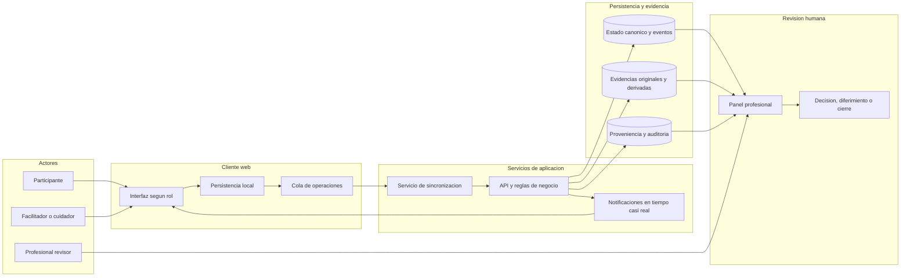
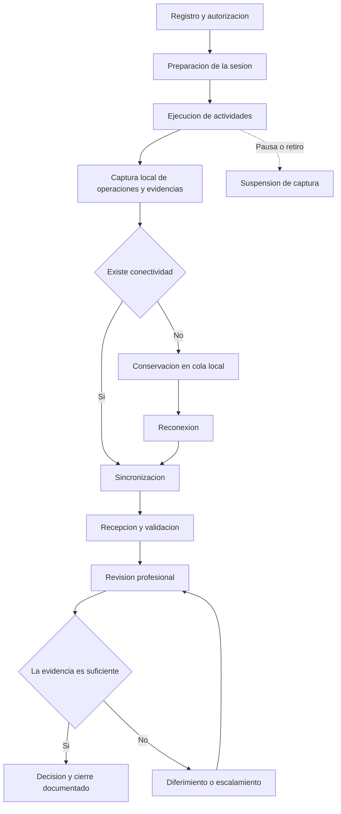
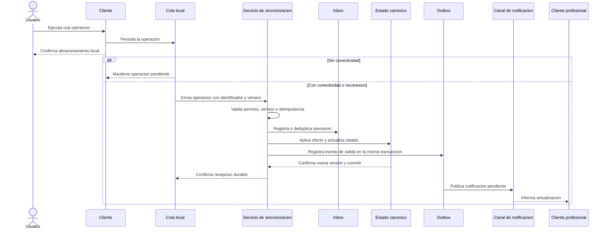
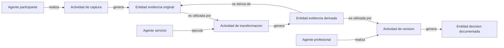

# CAPÍTULO III: ELABORACIÓN DE LA PROPUESTA

## 3.1 Generalidades

La propuesta consiste en una arquitectura de software distribuida orientada a eventos para procesos digitales en los que varios actores generan, sincronizan y revisan información desde distintos dispositivos. Su finalidad es mantener la continuidad de las operaciones ante conectividad variable, evitar efectos duplicados, conservar las evidencias digitales y permitir la reconstrucción del recorrido que conduce a una decisión documentada.

El diseño se organiza mediante Attribute-Driven Design (ADD), partiendo de los atributos de calidad y las restricciones declaradas para continuidad, consistencia, confiabilidad, integridad, trazabilidad y cierre humano. Las vistas arquitectónicas se documentan conforme a ISO/IEC/IEEE 42010: la vista de contexto y componentes se presenta en la sección 3.2, mientras que el desglose de responsabilidades y mecanismos se desarrolla en la sección 3.3.

La arquitectura integra un cliente web con capacidad de almacenamiento local, una cola de operaciones pendientes, servicios de sincronización, una base de datos canónica, almacenamiento de evidencias multimodales, registro de proveniencia, notificaciones en tiempo casi real y un módulo de revisión profesional. Cada operación se vincula con una sesión, un actor, un dispositivo y una versión del estado, de modo que pueda ser identificada durante su envío, reintento, validación y auditoría.

La evaluación digital del desarrollo infantil se utiliza como caso de estudio para instanciar actores, tareas, sesiones y evidencias. La propuesta no realiza diagnóstico automatizado, no valida las propiedades psicométricas del instrumento utilizado y no sustituye la responsabilidad del profesional autorizado. Su aporte se concentra en la continuidad, sincronización, integridad, trazabilidad y gobernanza del flujo de información.

## 3.2 Esquema de la propuesta

La propuesta organiza el flujo desde la captura de información en el cliente hasta la revisión y el cierre profesional. El esquema considera los actores participantes, la persistencia local, la sincronización de operaciones, el almacenamiento de evidencias y la reconstrucción de la trazabilidad de cada decisión.

La arquitectura se divide en cuatro ámbitos funcionales: actores, cliente web, servicios de aplicación y persistencia. En su despliegue, el cliente con persistencia local constituye el estrato próximo a la captura o *edge*, mientras que los servicios de aplicación, la persistencia canónica y el almacenamiento de evidencias constituyen el estrato central o *cloud*. La capa *fog* se mantiene como referente de distribución en los antecedentes, pero no forma parte del despliegue propuesto mientras no se incorpore un nodo intermedio con responsabilidades propias. El cliente permite operar según el rol asignado y conserva temporalmente las operaciones críticas cuando no existe conectividad. Los servicios validan las operaciones, actualizan el estado canónico, administran las evidencias y notifican los cambios relevantes. Finalmente, el profesional autorizado accede a las sesiones y evidencias para registrar una decisión, un diferimiento o un cierre.



**Figura 3.1. Esquema general de la arquitectura distribuida propuesta.**

**Nota.** Elaboración propia. La base de datos canónica conserva el estado durable; los mecanismos de notificación no reemplazan el registro persistente de las operaciones.

## 3.3 Componentes de la propuesta

### 3.3.1 Actores y flujo general

Los roles de la propuesta se definen por sus responsabilidades dentro del flujo y no por una persona específica. Esta separación permite que la arquitectura pueda utilizarse en procesos digitales con distintos contextos, manteniendo las responsabilidades de captura, acompañamiento, revisión y custodia de la información.

**Tabla 3.1. Actores y responsabilidades de la propuesta**

| Actor | Responsabilidad principal |
|---|---|
| Participante | Realizar actividades y generar respuestas o evidencias autorizadas. |
| Facilitador o cuidador | Preparar el entorno, acompañar la sesión y comunicar incidencias. |
| Profesional revisor | Revisar evidencias, registrar decisiones y determinar el cierre o diferimiento. |
| Administrador o custodio | Gestionar permisos, configuración y conservación de la información. |
| Servicio automático | Validar, sincronizar, almacenar y notificar sin emitir decisiones clínicas. |

En el caso de estudio, estos roles pueden corresponder al niño, cuidador, psicólogo y servicios de la plataforma. El flujo inicia con la autorización y preparación de la sesión; continúa con la captura local de operaciones y evidencias; y finaliza con la revisión humana. La pausa, el retiro, la desconexión y la evidencia insuficiente se registran como estados o decisiones explícitas del proceso.



**Figura 3.2. Flujo general del proceso multi-actor.**

**Nota.** Elaboración propia. La suficiencia de una evidencia, la pausa y el retiro son decisiones humanas registradas por el sistema; no son inferencias automáticas.

### 3.3.2 Cliente y operación con conectividad variable

El cliente web presenta las actividades y los estados disponibles para cada rol. Durante una sesión, captura respuestas y evidencias autorizadas, conserva las operaciones críticas en almacenamiento local y muestra su estado de sincronización. De esta manera, el usuario puede distinguir entre una operación guardada localmente, una operación pendiente de envío, una confirmada por el servidor o una que requiere intervención.

La continuidad local no equivale a que todos los actores ya observen el mismo estado. Cuando se recupera la conectividad, la cola local remite las operaciones pendientes al servicio de sincronización para que sean validadas y aplicadas sobre el estado canónico.

**Figura 3.3. Estado de conexión y sincronización en el cliente.**

```text
[INSERTAR CAPTURA O WIREFRAME DE LA INTERFAZ]

La imagen debe mostrar, como mínimo:
- estado de conexión;
- número o lista de operaciones pendientes;
- confirmación de almacenamiento local;
- estado de sincronización o conflicto.
```

**Nota.** La figura se incorporará con una captura de la versión identificada del prototipo o con un wireframe claramente rotulado como propuesta.

### 3.3.3 Sincronización distribuida orientada a eventos

La sincronización se basa en operaciones identificables y persistidas antes de su envío. Cada operación incluye una identidad única, la sesión a la que pertenece, el actor y dispositivo de origen, la versión base y los datos necesarios para ejecutar la acción. Esta información permite reconocer reintentos, detectar cambios concurrentes y evitar que una misma operación genere efectos de negocio duplicados.

**Tabla 3.2. Atributos mínimos de una operación sincronizable**

| Atributo | Finalidad |
|---|---|
| `operation_id` | Identificar la operación durante reintentos y evitar duplicaciones. |
| `session_id` | Relacionar la operación con una sesión concreta. |
| `actor_id` | Identificar al responsable de la acción. |
| `device_id` | Identificar el dispositivo de origen. |
| `base_version` | Detectar modificaciones concurrentes. |
| `device_sequence` | Mantener la secuencia local de operaciones. |
| `occurred_at` | Registrar el momento de origen de la operación. |
| `payload` | Conservar los datos necesarios para ejecutar la acción. |

El servicio de sincronización valida permisos, versiones e idempotencia antes de registrar la operación de manera durable. La bandeja de entrada o *inbox* registra la identidad de cada operación recibida para que un reintento no produzca un segundo efecto de negocio. En la misma transacción que actualiza el estado canónico, el servicio registra un evento de salida en la *outbox*. Un publicador posterior remite ese evento al canal de notificaciones después de la confirmación de la transacción. Así, una caída de Redis, WebSocket o del publicador no invalida la operación confirmada en PostgreSQL y el evento pendiente puede recuperarse.

La propuesta adopta entrega al menos una vez y efecto efectivamente único por deduplicación de `operation_id`; no supone entrega exactamente una vez en el transporte. La notificación facilita la actualización en tiempo casi real, pero la fuente de verdad permanece en la persistencia durable. Los clientes recuperan cambios omitidos mediante sincronización incremental por cursor o mediante un *snapshot* canónico.

**Tabla 3.3. Política de resolución de conflictos por tipo de operación**

| Situación | Regla de resolución | Resultado durable |
|---|---|---|
| Reintento con el mismo `operation_id` | Se deduplica en la *inbox* y se devuelve el resultado previamente registrado. | Un solo efecto de negocio y trazabilidad del reintento. |
| Operación con `base_version` desactualizada que modifica el mismo estado | Se rechaza con conflicto recuperable; no se aplica sobre la versión canónica. | Intento conservado para auditoría, respuesta `409` y versión canónica disponible. |
| Operaciones independientes sobre entidades distintas | Se aceptan y ordenan de forma determinista por sesión, secuencia de dispositivo e identificador de operación. | Ambas operaciones aplicadas sin sobrescritura. |
| Pausa o retiro frente a captura posterior | La pausa o el retiro tiene precedencia; la captura incompatible se rechaza y se conserva para auditoría. | Estado de gobernanza y motivo de rechazo trazables. |
| Revisión o corrección profesional concurrente | Se conserva cada intento y el caso se remite a revisión del profesional autorizado. | Ninguna corrección se pierde ni se resuelve mediante última escritura gana. |

**Nota.** La política se verificará con operaciones concurrentes y fallos inyectados. Las reglas podrán ampliarse por tipo de operación, pero no se aplicará última escritura gana como política universal.



**Figura 3.4. Secuencia propuesta para el registro y sincronización de una operación.**

**Nota.** Elaboración propia. La secuencia representa el comportamiento esperado de la propuesta y será comprobada mediante pruebas técnicas en el capítulo IV.

### 3.3.4 Gestión de evidencias multimodales

La propuesta permite relacionar respuestas estructuradas, eventos de interacción, imágenes, capturas y, cuando el protocolo lo autorice, audio o video. Cada evidencia se asocia con la sesión, tarea, actor, dispositivo, modalidad, momento de captura y estado de calidad que corresponda.

Las evidencias originales se conservan sin sobrescritura. Cuando una evidencia es transformada, por ejemplo, para generar una vista, un archivo procesado o un resumen técnico, el resultado se registra como un activo derivado con su propia versión y con referencia a la evidencia de origen. Si una evidencia esperada no se obtiene, su ausencia debe quedar documentada con la causa y el momento del registro.

**Tabla 3.4. Información asociada a las evidencias**

| Elemento | Información asociada |
|---|---|
| Evidencia original | Sesión, tarea, actor, dispositivo, modalidad, fecha y hash. |
| Evidencia derivada | Evidencia fuente, transformación, versión y responsable. |
| Estado de calidad | Modalidad, defecto, intervalo afectado y observación. |
| Ausencia documentada | Evidencia esperada, causa, momento y responsable del registro. |

**Figura 3.5. Registro o revisión de una evidencia multimodal.**

```text
[IMAGEN OPCIONAL]

Insertar una captura de la interfaz de captura o revisión que muestre:
- modalidad de evidencia;
- estado de carga o disponibilidad;
- fecha o momento de registro;
- referencia de calidad, cuando corresponda.
```

### 3.3.5 Proveniencia y trazabilidad

La trazabilidad se modela mediante la relación entre entidades, actividades y agentes. Una entidad puede ser una respuesta, un archivo, una evidencia derivada o una decisión. Una actividad representa una captura, sincronización, transformación, revisión o cierre. Un agente es el participante, facilitador, profesional o servicio que interviene en la actividad.

Este modelo permite recorrer una decisión documentada hasta las evidencias que la sustentan y, en sentido contrario, determinar qué transformaciones, revisiones o resultados se relacionan con una evidencia original. La trazabilidad no se limita a conservar registros aislados, sino que mantiene las relaciones necesarias para explicar el proceso.



**Figura 3.6. Modelo conceptual de proveniencia de las evidencias.**

**Nota.** Elaboración propia. El modelo representa las relaciones mínimas necesarias para reconstruir el linaje de una decisión o evidencia.

### 3.3.6 Gobernanza y cierre humano

La propuesta incorpora controles de acceso y decisiones humanas dentro del flujo de la sesión. Los permisos delimitan qué actor puede visualizar, capturar, modificar, revisar o cerrar información. El consentimiento, el asentimiento, la pausa y el retiro se registran como estados o decisiones trazables, de acuerdo con las reglas definidas para la sesión.

El cierre no se produce únicamente por la finalización de una actividad. Requiere que la información sea recibida, asignada cuando corresponda, revisada por un profesional autorizado y asociada con una decisión o acción siguiente. Si la evidencia es insuficiente, el flujo permite diferir el caso o escalarlo para una revisión adicional.

**Tabla 3.5. Controles de gobernanza y cierre**

| Control | Aplicación en la propuesta |
|---|---|
| Consentimiento | Autoriza finalidades y modalidades definidas. |
| Asentimiento | Se registra como decisión humana continua y revocable. |
| Pausa | Suspende temporalmente la captura y el avance de la sesión. |
| Retiro | Impide nuevas operaciones y activa el procedimiento establecido. |
| Revisión | Vincula evidencias, profesional y decisión registrada. |
| Cierre | Registra revisión, decisión y acción siguiente. |

**Figura 3.7. Panel de revisión profesional.**

```text
[INSERTAR CAPTURA O WIREFRAME DEL PANEL PROFESIONAL]

La imagen debe mostrar, como mínimo:
- sesión asignada;
- evidencias disponibles;
- estado de revisión;
- campo de observaciones;
- decisión, diferimiento o cierre.
```

**Nota.** La captura deberá anonimizar información personal y corresponder a una versión identificada del prototipo.

## 3.4 Infraestructura tecnológica y decisiones arquitectónicas

Las tecnologías seleccionadas se organizan según la responsabilidad que cumplirán dentro de la arquitectura. La elección busca separar la interacción del cliente, la persistencia local, las reglas de negocio, la notificación y el almacenamiento durable. La configuración realmente utilizada, sus versiones y recursos se documentarán en el capítulo IV.

**Tabla 3.6. Tecnologías seleccionadas para la propuesta**

| Elemento | Tecnología | Función en la propuesta |
|---|---|---|
| Interfaz web | React y TypeScript | Presentar vistas por rol y capturar operaciones. |
| Estado del cliente | Zustand | Administrar estado de sesión e interfaz. |
| Persistencia local | IndexedDB | Conservar operaciones durante desconexiones. |
| Servicios de aplicación | Django y Django REST Framework | Implementar reglas de negocio, API y sincronización. |
| Comunicación conectada | Django Channels y WebSocket | Notificar cambios en tiempo casi real. |
| Transporte interno | Redis | Facilitar comunicación entre procesos. |
| Persistencia canónica | PostgreSQL | Conservar estado, versiones, eventos y auditoría. |
| Entorno reproducible | Docker | Preparar servicios e infraestructura de forma consistente. |

PostgreSQL se establece como fuente durable del estado y de las operaciones confirmadas. Redis y WebSocket se utilizarán para transporte y notificación, por lo que no sustituirán la persistencia canónica. IndexedDB permitirá conservar operaciones en el cliente, pero la convergencia con el estado compartido deberá alcanzarse mediante el proceso de sincronización descrito.

**Tabla 3.7. Decisiones arquitectónicas principales**

| Decisión | Alternativa descartada | Justificación |
|---|---|---|
| PostgreSQL como estado canónico y registro durable | CRDT como mecanismo general de convergencia | Las transiciones críticas requieren permisos, versiones, auditoría y coordinación; los CRDT pueden emplearse en tipos compatibles, pero no sustituyen esas invariantes. |
| WebSocket para notificaciones conectadas | SSE como canal principal | La propuesta requiere comunicación bidireccional persistente para notificar y coordinar clientes conectados. La recuperación no depende del canal, sino de cursor y *snapshot* REST. |
| *Inbox* y *outbox* transaccionales | Publicación directa después de modificar el estado | Separan la confirmación durable de la publicación y evitan efectos duplicados ante reintentos, reinicios o fallos del canal. |
| IndexedDB para persistencia local | Memoria del navegador o cola solo en servidor | Permite conservar operaciones críticas y evidencias pendientes durante desconexiones y reinicios del navegador. |

## 3.5 Proceso de construcción de la propuesta

La construcción se organizará por etapas dependientes. Cada etapa producirá un artefacto verificable y no se considerará terminada únicamente por disponer de código. Se exigirá correspondencia entre requisito, componente, prueba y evidencia.

**Tabla 3.8. Etapas previstas de construcción**

| Etapa | Procedimiento | Producto verificable |
|---|---|---|
| 1. Modelo de dominio | Definir actores, agregados, estados, operaciones, eventos, evidencias e invariantes. | Catálogo versionado y máquina de estados. |
| 2. Identidad y gobernanza | Implementar identidades por rol y dispositivo, permisos por recurso, consentimiento por modalidad, asentimiento, pausa y retiro. | Matriz de autorización y registros auditables. |
| 3. Registro durable | Crear el contrato común de operación, control de versión, deduplicación, *inbox* y *outbox* transaccionales. | Operaciones identificables y recuperables después de fallos. |
| 4. Cliente offline | Persistir operaciones en IndexedDB antes del envío, recuperar la cola al reiniciar y clasificar errores y conflictos. | Cola durable común y estado visible por operación. |
| 5. Evidencias multimodales | Separar originales, derivados, transformaciones, calidad y ausencias; calcular integridad y aplicar retención. | Manifiesto de evidencias y activos inmutables. |
| 6. Proveniencia | Representar entidades, actividades, agentes y relaciones desde captura hasta decisión. | Consulta de linaje en ambos sentidos y detección de huecos. |
| 7. Revisión y cierre | Exigir recepción, asignación, decisión explícita por ítem y cierre profesional antes de una salida final. | Flujo de revisión y cierre auditable. |
| 8. Instrumentación | Propagar identificadores, capturar telemetría y construir generadores, inyectores y oráculos. | Banco reproducible de validación técnica. |

En cada etapa se aplicarán pruebas unitarias y de integración antes de avanzar. Las operaciones críticas incluirán respuestas, eventos, cambios de gobernanza, evidencias, revisiones y cierre. La construcción no asumirá que una capacidad de interfaz equivale a una garantía del backend; las restricciones de autorización, versión y cierre deberán comprobarse sobre las API y la persistencia.

## 3.6 Evaluación prevista de la arquitectura

La evaluación verifica el comportamiento de la arquitectura y no la validez del instrumento empleado como caso de prueba. Antes de ejecutar la evaluación confirmatoria se congelarán la versión del prototipo, la configuración de infraestructura, los datos sintéticos, los guiones, los indicadores, los criterios de aceptación y las reglas para tratar datos faltantes. Cada ejecución conservará identificación de versión, fecha, escenario, configuración, resultados de telemetría, trazas y desviaciones.

**Tabla 3.9. Escenarios de evaluación arquitectónica previstos**

| Código y escenario | Objetivo | Configuración prevista | Indicadores | Técnica e instrumento |
|---|---|---|---|---|
| E0: operación nominal | Establecer la línea base conectada. | Una sesión y red estable; corpus sintético sellado. | `I03-I06`, `I13-I34` aplicables. | Guion funcional, telemetría, manifiesto y oráculo. |
| E1: carga concurrente | Medir capacidad y tiempo casi real. | 1, 10, 25, 50 y 100 sesiones; duración y repeticiones congeladas. | `I03-I06`, `I28`. | Generador de carga y métricas de aplicación, sistema y red. |
| E2: desconexión | Comprobar continuidad y persistencia local. | Corte de red antes y después de confirmar almacenamiento local. | `I01-I02`, `I08`, `I20`. | Controlador de red, inspector local y manifiesto externo. |
| E3: reconexión | Comprobar recuperación y convergencia. | Cola con operaciones y evidencias pendientes; restablecimiento controlado. | `I02`, `I07-I09`, `I20`. | Snapshots, hashes, reconciliador y oráculo independiente. |
| E4-E6: replay, omisión y desorden | Verificar idempotencia, pérdida detectable y precedencias. | Duplicación, omisión temporal, retraso y permutación de mensajes. | `I08-I10`, `I16`. | Inyector de fallos, auditor de efectos y secuenciador. |
| E7: reinicios y fallos de componentes | Verificar durabilidad ante caídas. | Reinicio de cliente, API, publicador, Redis o persistencia según aplicabilidad. | `I02`, `I08-I09`, `I17-I19`. | Orquestador, registros durables y comparación antes/después. |
| E8: conflictos concurrentes | Comprobar detección y resolución por política. | Dos actores con la misma versión base y operaciones compatibles o incompatibles. | `I07`, `I11-I12`, `I19`, `I30`. | Barreras, versiones, matriz de resolución y auditoría. |
| E9: recorrido integral | Verificar multi-actor, trazabilidad, permisos y cierre. | Captura, transformación, revisión y decisión con fallos combinados. | `I13-I39` aplicables. | Grafo de linaje, matriz RBAC, bitácoras y lista de cierre. |

Los escenarios se ejecutarán inicialmente con datos sintéticos. La evaluación con participantes, si obtiene autorización ética e institucional, será exploratoria y se analizará por separado mediante instrumentos de observación, encuesta y entrevista. Ningún resultado de usabilidad o factibilidad sustituirá los indicadores técnicos de continuidad, confiabilidad, integridad o trazabilidad.

Para cada escenario, el capítulo IV documentará la configuración realmente empleada, los pasos ejecutados, las versiones, las repeticiones y las desviaciones. El capítulo V presentará los valores obtenidos y, en una sección separada, su interpretación y contraste con el estado del arte.

## 3.7 Síntesis de la propuesta

La propuesta integra operación local, sincronización multi-actor, control de operaciones, gestión de evidencias, proveniencia, gobernanza y revisión humana dentro de una misma arquitectura. La separación de responsabilidades permite identificar dónde se origina una operación, cómo se conserva durante una desconexión, de qué forma se valida y cómo se relaciona con las evidencias y decisiones posteriores.

El capítulo III define qué se construirá y cómo se evaluará. No presenta resultados de implementación ni de pruebas. La descripción de lo efectivamente construido y ejecutado corresponde al capítulo IV, mientras los resultados y su discusión corresponden al capítulo V.
